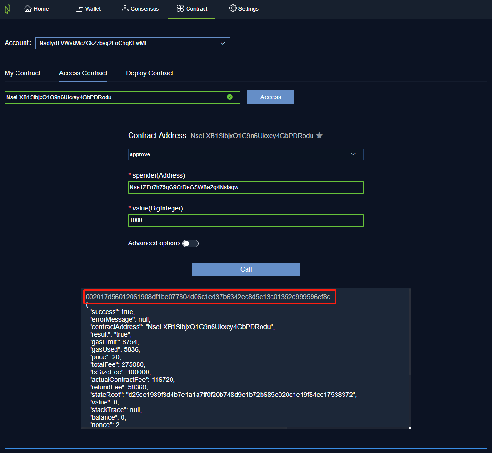
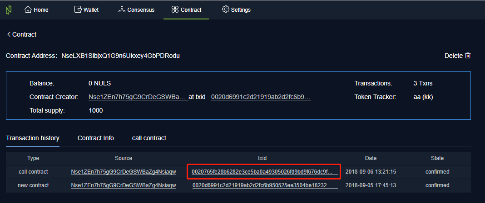

# 钱包智能合约使用文档

## 部署合约

1 启动钱包，点击【合约】，点击【部署合约】tab页

2 在文本框中填入合约的Hex编码

3 填写合约构造函数参数，注意必填项和值类型，否则表单校验无法通过

4 点击【高级选项】，可更改GasLimit和GasPrice的默认值，还可继续填写附加信息，该字段为非必填项。（此步骤为可选操作）

5 表单填写完成后，点击【测试合约】，钱包将对该合约进行一次测试部署，验证合约的合法性。

6 测试通过后，点击【部署合约】，若当前账户有密码则输入密码，然后点击【确认】。无密码，则直接点击【确认】。此时系统会跳转到【我的合约】页面，可在此页面查看部署合约的确认进度。

查看部署合约的确认进度

7 确认完成后

- 点击表格右方的操作【去调用】可直接进入【调用合约】页面

- 点击合约地址可直接进入合约概览的页面

## 查看合约

1 启动钱包，点击【合约】，点击【查看合约】tab页

2 在输入框中输入合法的合约地址，点击【访问】，下方会出现一个面板

- 点击面板中的【下拉列表】，可以选择要调用的合约方法
- 点击合约地址旁的星星图标，可以收藏该合约至我的合约列表

3 选择某一个方法后有以下两种情况

- 方法为只读方法，点击【调用】则会在网络请求完成后立即返回调用结果

	

- 方法为可写方法（需上链），可点击高级选项，更改GasLimit和GasPrice的默认值，点击【调用】后，该操作会发起一个交易，需要消耗nuls，因此若设置了账户密码，则需要输入密码。交易确认后，返回调用结果。

	调用合约交易确认中

	

	调用合约交易已确认

	

4 若调用的上链方法，可点击面板中的TxID查看本次调用合约交易的详情

调用合约交易详情

## 我的合约

1 我的合约列表中展示了当前账户创建的合约和收藏的合约

- 点击合约地址，可进入合约概览页面

		

- 点击去调用，可进入该合约的【调用合约】页面

	

- 点击【取消收藏】可将该合约从【我的合约】列表中移除

3 【交易记录】中展示的是该合约内部的交易，点击TxID，可查看该条交易的详情

4 【合约详情】中展示的是该合约的所有方法，对应的参数和返回值类型

5 若合约由当前账户创建，可点击合约概览右上方的【删除】图标删除该合约，合约被删除后，可继续查看合约详细信息，但无法继续调用合约的方法

## 账户多资产

通过智能合约发行Token或由其他账户转入不同类型Token后，账户就会出现多资产

1 进入钱包，可查看当前账户地址下的所有类型资产

2 点击【转账】可进入该类型资产的转账界面，输入收款地址和转账金额，可进行该类型资产的转账操作

3 点击【交易记录】可进入该类型资产的交易记录页面

4 在【交易记录】页面可通过点击下拉列表进行切换不同类型资产的交易记录

5 点击TxID可查看该条交易记录详情

