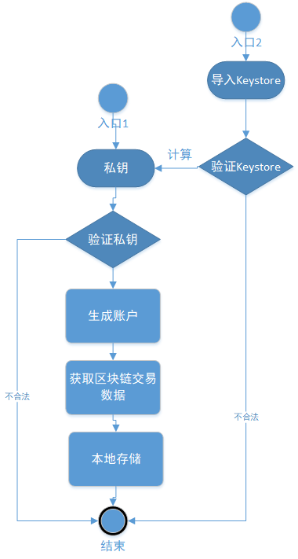

title: 账户模块
---

# NULS账户模块解析

## 1、模块概述

​	NULS账户模块是为NULS主链提供关于账户各项功能的基础性模块。主要对账户的生成、安全和保管、信息的获取等几个方面的功能提供支持，其他模块可以根据账户模块提供的接口来使用账户的各种功能以及获取账户信息，用户或者其他应用可以根据RPC接口对账户进行更加实用性和个性化的操作。账户是NULS的基础模块，也是用户数据的载体（展示窗口），随着NULS的发展，账户模块也将更加完备。


## 2、模块功能

​	账户模块的功能比较丰富，相同功能也会提供多个接口的重载，方便不同场景下的使用，主要有以下几个方面。

#### 2.1 账户的生成

​	账户的生成方面包含创建账户、导入账户；而导入账户分为导入私钥生成账户、导入Keystore备份文件生成账户。

#### 2.2 账户的安全和保管

​	账户安全方面的功能包含账户的备份、设置账户密码、修改账户密码、移除账户；备份账户分为生成Keystore备份文件、获取私钥来备份。

#### 2.3 账户信息的获取

​	账户信息的获取方面的功能主要有查询单个账户信息、获取多个账户信息、获取账户地址、查询账户余额、查询账户别名等。

#### 2.4 其他实用性和个性化功能

​	账户的功能还包括一些特殊的工具功能、个性化功能，主要有设置账户别名、设置账户备注、验证账户是否加密、签名、验证签名、验证账户地址格式、验证账户密码是否正确等功能。

#### 2.5 账户本地数据的存取

​	除账户别名的数据外账户的数据都会进行本地的持久化，所以账户模块有对账户数据的存取的功能，功能的最终实现是调用数据存储模块的接口来实现。


## 3、模块接口

- 接口定义类 `io.nuls.account.service.AccountService`

```java

    /**
     * 创建指定个数的账户（包含地址）
     * 
     * Create a specified number of accounts,and encrypt the accounts,
     * all the accounts are encrypted by the same password
     * if the password is NULL or "", the accounts will be unencrypted.
     *
     * @param count    想要创建的账户个数
     * @param count    the number of account you want to create.
     * @param password the password of the accounts.
     * @return the account list created.
     */
    Result<List<Account>> createAccount(int count, String password);

    /**
     * 创建指定个数的账户（包含地址）
     * Create unencrypted accounts.
     *
     * @param count 想要创建的账户个数
     * @param count the number of account you want to create.
     * @return the account list created.
     */
    Result<List<Account>> createAccount(int count);

    /**
     * 创建指定个数的账户（包含地址）
     * 
     * Create an account and encrypt it,
     * if the password is NULL or "", the accounts will be unencrypted.
     *
     * @param password the password of the accounts(only one account in the list).
     * @return the account list created.
     */
    Result<List<Account>> createAccount(String password);

    /**
     * 创建一个账户
     * 
     * Create an unencrypted account
     *
     * @return the account list created(only one account in the list).
     */
    Result<List<Account>> createAccount();

    /**
     * 根据账户标识删除对应的账户
     * 
     * delete an account by address.
     *
     * @param address  the address of the account you want to delete.
     * @param password the password of the account.
     * @return the result of the operation.
     */
    Result<Boolean> removeAccount(String address, String password);


    /**
     * 根据keyStore重置密码
     * 
     * Reset password by keyStore.
     *
     * @param keyStore the keyStore of the account.
     * @return the result of the operation.
     */
    Result<Account> updatePasswordByAccountKeyStore(AccountKeyStore keyStore, String password);

    /**
     * 从keyStore导入账户(密码用来验证keystore)
     * 1.从keyStore获取明文私钥(如果没有明文私钥,则通过密码从keyStore中的encryptedPrivateKey解出来)
     * 2.通过keyStore创建新账户,加密账户
     * 3.从数据库搜索此账户的别名,没有搜到则不设置(别名不从keyStore中获取,因为可能被更改)
     * 4.保存账户
     * 5.导入账户账本交易等信息
     * 
     * import an account form account key store.
     *
     * @param keyStore the keyStore of the account.
     * @return the result of the operation.
     */
    Result<Account> importAccountFormKeyStore(AccountKeyStore keyStore, String password);

    /**
     * 从keyStore导入账户
     * 1.从keyStore获取明文私钥
     * 2.通过keyStore创建新账户,不加密账户
     * 3.从数据库搜索此账户的别名,没有搜到则不设置(别名不从keyStore中获取,因为可能被更改)
     * 4.保存账户
     * 5.导入账户账本交易等信息
     * 
     * import an account form account key store.
     *
     * @param keyStore the keyStore of the account.
     * @return the result of the operation.
     */
    Result<Account> importAccountFormKeyStore(AccountKeyStore keyStore);


    /**
     * 根据私钥和密码导入账户
     * import an account from plant private key and encrypt the account.
     */
    Result<Account> importAccount(String prikey, String password);

    /**
     * 据私钥和密码导入账户
     * import an unencrypted account by plant private key.
     */
    Result<Account> importAccount(String prikey);

    /**
     * 导出账户到keyStore
     * 
     * export an account to an account key store.
     *
     * @param address  the address of the account.
     * @param password the password of the account key store.
     * @return the account key store object.
     */
    Result<AccountKeyStore> exportAccountToKeyStore(String address, String password);

    /**
     * 根据账户地址byte[]获取完整的账户信息
     * 
     * Query account information by address.
     *
     * @param address the address of the account you want to query.
     * @return the account.
     */
    Result<Account> getAccount(byte[] address);

    /**
     * 根据账户地址字符串获取完整的账户信息
     * 
     * Query account by address.
     *
     * @param address the address of the account you want to query.
     * @return the account.
     */
    Result<Account> getAccount(String address);

    /**
     * 根据账户地址类对象获取完整的账户信息
     * Query account by account address.
     *
     * @param address the address of the account you want to query;
     * @return the account.
     */
    Result<Account> getAccount(Address address);

    /**
     * 根据账户公钥获取账户地址对象
     * Query account address by public key.
     *
     * @param pubKey public key string.
     * @return the account address.
     */
    Result<Address> getAddress(String pubKey);

    /**
     * 根据账户二进制公钥获取账户地址对象
     * Gets the account address object from the account binary public key.
     *
     * @param pubKey public key binary array.
     * @return the account address.
     */
    Result<Address> getAddress(byte[] pubKey);

    /**
     * 根据账户验证账户是否加密
     * Verify weather the account is encrypted according to the account.
     *
     * @param account the account to be verified.
     * @return the result of the operation.
     */
    Result isEncrypted(Account account);

    /**
     * 根据账户的地址对象验证账户是否加密
     * Verify weather the account is encrypted according to the account's address object.
     *
     * @param address The address of the account to be verified.
     * @return the result of the operation.
     */
    Result isEncrypted(Address address);

    /**
     * 根据账户的地址字符串验证账户是否加密
     * Verify weather the account is encrypted according to the account's address string.
     *
     * @param address The address of the account to be verified.
     * @return the result of the operation.
     */
    Result isEncrypted(String address);

    /**
     * Verify the account password.
     *
     * @param account
     * @param password
     * @return
     */
    Result validPassword(Account account, String password);

    /**
     * 验证地址字符串的格式
     * Verify the format of the address string.
     *
     * @param address To verify the address string.
     * @return the result of the operation.
     */
    Result verifyAddressFormat(String address);

    /**
     * 获取所有账户集合
     * Query all account collections.
     *
     * @return account list of all accounts.
     */
    Result<Collection<Account>> getAccountList();

    /**
     * 数据签名
     * Sign data.
     *
     * @param data     Data to be signed.
     * @param account  Signed account
     * @param password Account password
     * @return The NulsSignData object.
     */
    NulsSignData signData(byte[] data, Account account, String password) throws NulsException;

    /**
     * 数据签名(无密码)
     * Sign data.(no password)
     *
     * @param data    Data to be signed.
     * @param account Signed account
     * @return The NulsSignData object.
     */
    NulsSignData signData(byte[] data, Account account) throws NulsException;

    /**
     * 数据签名
     * Sign data.
     *
     * @param data  Data to be signed.
     * @param ecKey eckey.
     * @return The NulsSignData object.
     */
    NulsSignData signData(byte[] data, ECKey ecKey) throws NulsException;

    /**
     * 数据签名
     * Sign data.
     *
     * @param digest   data digest.
     * @param account  account to sign.
     * @param password password of account.
     * @return the NulsSignData object.
     */
    NulsSignData signDigest(byte[] digest, Account account, String password) throws NulsException;

    /**
     * 数据签名
     * Sign data digest
     *
     * @param digest to be signed.
     * @param ecKey  eckey
     * @return The NulsSignData object.
     */
    NulsSignData signDigest(byte[] digest, ECKey ecKey);

    /**
     * 验证签名
     * Verify the signature.
     *
     * @param data     data to be validated.
     * @param signData signature.
     * @param pubKey   dublic key of account.
     * @return the result of the opration
     */
    Result verifySignData(byte[] data, NulsSignData signData, byte[] pubKey);

    /**
     * 获取所有的账户的余额
     * Query the balance of all accounts.
     *
     * @return Balance object.
     */
    Result<Balance> getBalance() throws NulsException;

    /**
     * 根据账户获取账户余额
     * Query the balance of an account.
     *
     * @param account the account.
     * @return Balance object.
     */
    Result<Balance> getBalance(Account account) throws NulsException;

    /**
     * 根据账户地址对象获取账户余额
     * Query the balance of an account.
     *
     * @param address the address of the account.
     * @return Balance object.
     */
    Result<Balance> getBalance(Address address) throws NulsException;

    /**
     * 根据账户地址字符串获取账户余额
     * Query the balance of an account.
     *
     * @param address the address of the account.
     * @return Balance object.
     */
    Result<Balance> getBalance(String address) throws NulsException;


    /**
     * 根据账户地址字节数组获取账户别名
     * Get an account alias based on the array of account address bytes
     *
     * @param address
     * @return alias string
     */
    Result<String> getAlias(byte[] address);

    /**
     * 根据账户地址获取账户别名
     * Get account alias according to account address
     *
     * @param address
     * @return alias string
     */
    Result<String> getAlias(String address);

    /**
     * 获取设置别名交易手续费
     * Gets to set the alias transaction fee
     *
     * @param address
     * @param aliasName
     * @return
     */
    Result<Na> getAliasFee(String address, String aliasName);

```


## 4、模块架构

- 模块名称：account
- 模块ID：5


## 5、模块协议

##### 5.1 通用交易数据结构

| 尺寸 | 字段       | 数据类型 | 说明           |
| ---- | ---------- | -------- | -------------- |
| 2    | type       | uint16   | 交易类型       |
| 6    | time       | uint48   | 时间戳         |
| ??   | remark     | VarByte  | 备注           |
| ??   | txData     | ??       | 交易数据       |
| ??   | coinData   | ??       | 代币数据       |
| ??   | scriptSign | VarByte  | P2PKHScriptSig |

##### 5.2 别名交易

- txData：Alias

**Alias**

| 尺寸 | 字段    | 数据类型 | 说明               |
| ---- | ------- | -------- | ------------------ |
| 2    | address | VarByte  | 设置别名的账户地址 |
| ？？ | alias   | String   | 别名名称           |

## 6、核心流程

#### 6.1 账户生成

##### 	6.1.1 创建账户

​	NULS的账户地址是通过NULS的默认Chain ID、以及NULS默认地址类型、ECKey（椭圆曲线加密算法）的组合生成的，固定长度为23。生成的Byte数组通过Base58算法得到NULS账户的地址字符串。创建新的账户时ECKey是通过随机种子生成的ECKey实例，通过ECKey得到账户的公钥和私钥以及账户地址即可生成一个新账户。

##### 6.1.2 备份

​	生成账户后即可通过接口得到账户的明文私钥，即可对私钥进行妥善的保管（即备份），同时也可以通过备份Keystore文件的接口来生成一个备份文件进行备份。

​	备份Keystore时要分两种情况：

​	1、账户没有密码时备份

​	账户没有密码时直接调用接口生成备份文件，文件已账户地址命名，文件后缀为`.keystore`。并且Keystore中的私钥为明文私钥（prikey有值，encryptedPrivateKey没有值）。

​	2、账户有密码时备份

​	账户有密码备份时调用生成备份文件的时候需要验证当前账户密码，并且使用该密码为Keystore中的私钥加密，在生成的文件中加密后的私钥有值（encryptedPrivateKey有值），明文私钥时没有值的（prikey无值）。

##### 6.1.3 导入账户（私钥、Keystore文件）

​	导入账户是用户出于某种原因想要在本地重新生成自己的账户信息，用户需要持有对应账户的私钥或者Keystore备份文件。私钥和Keystore的区别在于，Keystore（在账户设置有密码的情况下）可以保存加密后的私钥，而不用保存明文私钥，所以安全性更高。在这种情况下导入Keystore文件时会同时验证在生成该Keystore文件时账户的密码，通过该密码和加密后的私钥，可以计算出明文私钥，然后进行下一步导入流程。

​	而不管用户用什么方式导入，最终都是通过账户的私钥来生成对应的ECKey实例，然后和创建账户相同的方式生成账户信息，与创建账户不同的是得到ECkey实例的方式不一样。像这样通过同一个私钥来生成的账户，信息都是一致的，然后会通过账户账本从区块链中获取该账户的转账、设置别名、创建节点、委托等交易数据到同步到本地，从而实现了导入账户的功能。

​	虽然Keystore文件中存有账户的别名，不过由于Keystore文件可能被串改和伪造，所以在导入账户时仍然需要通过从区块链中获取账户设置别名交易的信息来还原账户的别名信息，这正是利用了区块链信息不可篡改的特性。



	##### 6.1.4 设置账户别名

​	设置账户别名会花费1NULS，这1NULS会被转到固定的空洞地址燃烧掉，账户设置的别名会被保存在区块链中，并且别名在区块链中是唯一的，通过这些验证后会发起一笔交易，并且会发送到其他节点进行验证、打包、确认，之后设置别名就算成功。