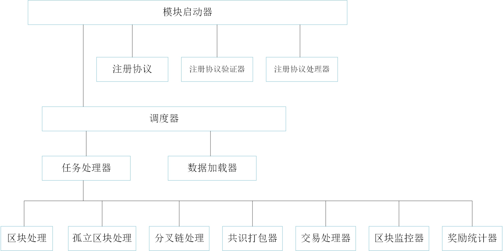
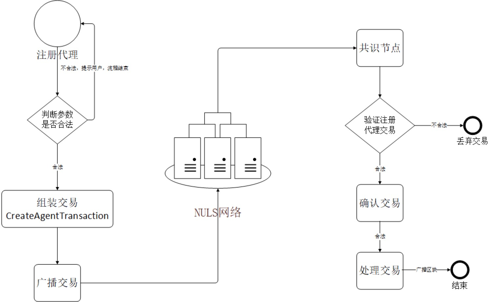
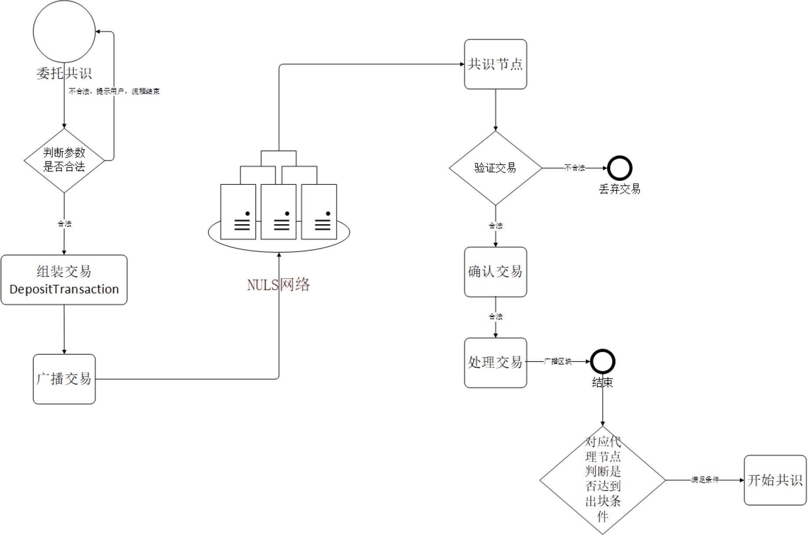
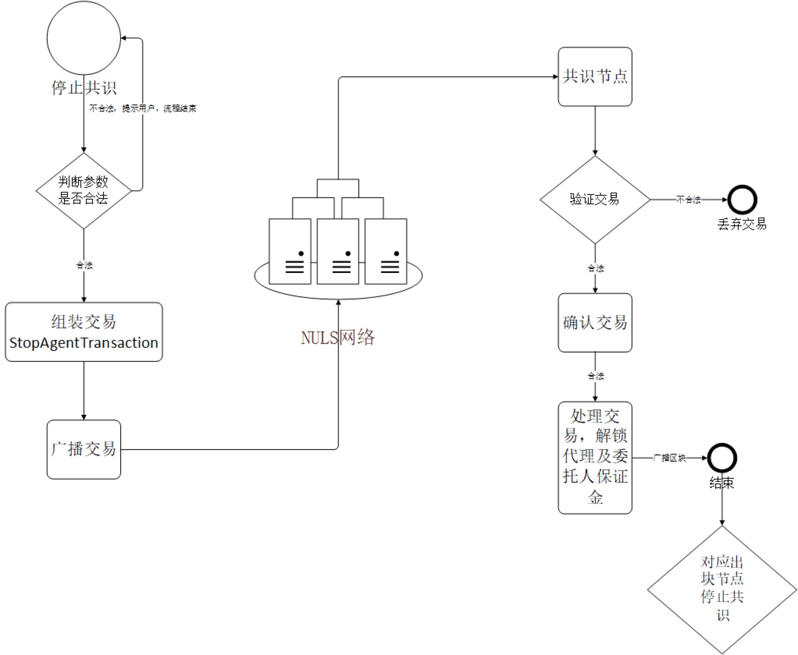
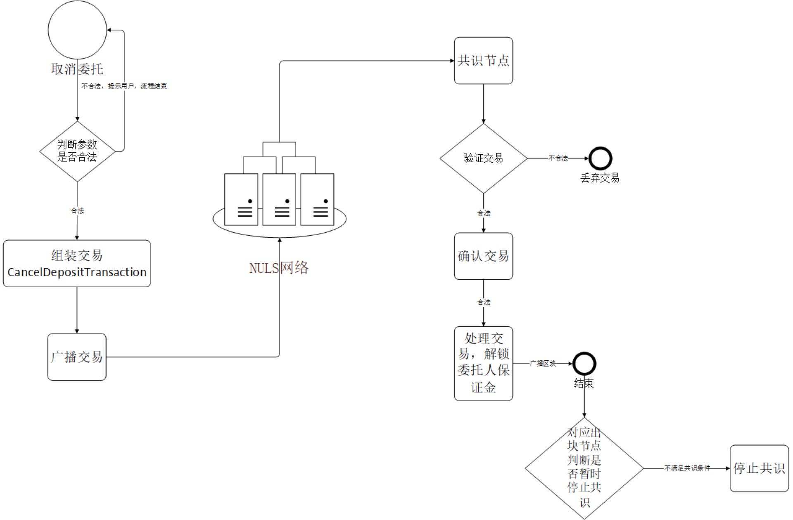
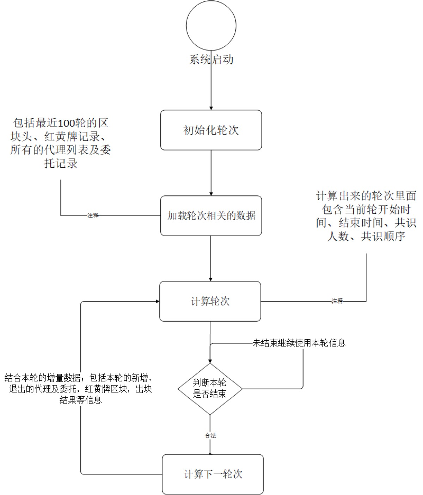
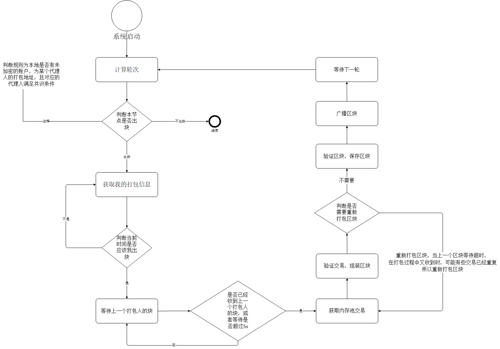
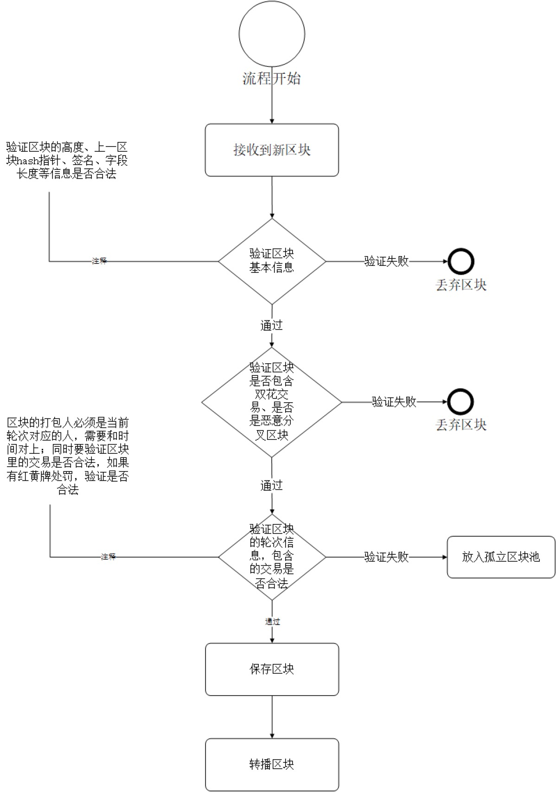

title: NULS共识模块解析
---

## 1、模块概述
​	众所周知，区块链的核心是共识机制。和传统互联网的cliet-server架构不同，区块链的节点是对等的，没有中心，大家权利一样；所以为了使数据达到一致性，让一个没有中心的网络维护一套大家都认同的账本，这就是共识机制的作用。
​	
​	
​	公链共识机制有多种，NULS主网采用自主原创的POC（Proof Of Credit）共识机制，一种继承了Dpos共识机制的安全性和高效率，同时在协作方面进行了非常大的改进，可以看成是一种升级版的Dpos。
​	
​	
​	NULS的共识模块，在接口层进行了高度抽象，提炼出了一些必须的功能接口，其实现为POC共识。在NULS的模块化架构基础上，可以实现其它任何可能的共识机制。期待社区、个人或者机构实现其需要的共识机制，并贡献代码到NULS的主仓库，未来可供选择的共识机制除POC外，会有POW、POS、DPOS、PBTF等多种共识算法。
​	
​	
​	本章节重点介绍NULS的共识模块接口定义，以及默认POC共识机制的实现细节。
​	
​	
​	**模块信息**
​	
​	模块名称：consensus-module
​	
​	模块结构：模块顶级目录consensus-module，consesnus工程为模块接口定义，poc实现目录poc，poc实现工程consensus-poc-base，consensus-poc-protocol共识实现相关网络协议，consensus-poc-storage共识存储接口和实现工程
​	
​	接口定义依赖模块：**protocol-module、network-module**
​	
​	实现额外依赖模块：**core-module、ledger-module、account-module、account-ledger-module**

## 2、模块功能
​	本小节从两个层面来介绍NULS的共识模块功能。第一层面从对外提供的接口功能角度进行描述，外部接口是多种共识算法可能需要的共用抽象接口；第二层面从POC实现的功能需求进行概括阐述。

### 2.1 外部接口

* 新交易：节点接收到的网络上的新交易，验证通过之后，需要放到一个统一的内存池里，以供共识模块确认这些交易（也就是打包交易到区块里）；同时接收到新的区块时，通过查找这些现场的交易，快速组装成一个完整的区块（因为新区块产生，广播给对等节点的是区块头信息和交易哈希列表）。

* 获取内存池交易：共识模块对外提供一个查询待确认交易列表的方法，以供其它模块有需要的时候调用。

* 获取单笔交易：查询一笔交易，实际上NULS系统的交易，是应该账本模块提供，但账本模块提供的交易都是已经确认的交易，未确认的交易在共识模块的内存池中，所以共识模块对外提供一个查找单笔交易的功能接口，同时包含查找未确认的交易。

* 新区块：
	- 下载过程中接收到下载的目标区块：一个节点刚启动，节点的本地区块数据很可能不是最新的数据，需要从其它对等节点下载增量区块，下载到的区块需要进入共识模块，通过相应的共识规则，则认为下载的区块无误，添加到主链并保存。
	- 运行过程中接收到的新产生的区块：收到网络发来的一个新诞生的区块，通用协议模块会得到完整的区块信息（采取组装交易的方式，若本地找不到某些交易，则向对应的节点下载），然后把完整的区块交给共识模块进行验证--入库等操作。
	- 以上两种场景，是否采用同一个业务逻辑进行处理，取决于共识机制的选择，比如POC共识，唯一不同的地方在于验证时的轮次信息不一致，前者是采用计算历史轮次来验证，后者是采用当前共识论处进行验证；如果POW共识的实现，完全可以使用同一个业务逻辑。也就是具体的实现可以自己决定是否复用代码。

* 回滚区块：区块的回滚，是指当节点发现网络上有一条比本地主链更长的链可选择时，接受网络上的这条更长的链作为本地新的主链，这时需要把本地主链中，没有包含在网络上这条更长链里的区块统统删掉，相应的区块里面的交易也要进行删除（同时相应的业务逻辑也要倒退，专业术语叫做回滚）。理论上绝大部分时候，是否有分叉，是否需要分叉处理，取决于共识机制的实现方式和选择，大部分时候共识机制实现内部进行了相关的处理，共识模块提供此接口功能，以供其它模块需要时调用（比如初次启动下载，就可能需要回滚区块）。特别说明一下，不是所有的共识机制都需要回滚。

### 2.2 POC功能需求分析
要实现POC，首先需要知道POC的设计理念和业务规则，以下内容摘自NULS白皮书POC共识介绍部分，如果熟悉可直接跳过。

```
共识机制——POC
 NULS 的模块化设计，支持共识机制在内的所有核心功能模块的替换与插拔。
NULS 主链默认采用信用共识机制 POC(Proof-Of-Credit)。节点信用达标的情
况下，锁定一定保证金即可加入共识，共识节点重新排序后每轮轮流出块，退出
共识时保证金解锁。
1、共识进入与退出机制
任何人都可以随时加入 NULS 的共识之中，只要满足条件，遵守规则，即可
持续获得 NULS 代币奖励。POC 的加入分为硬性指标和软性指标。硬性指标指
的是信用分值必须达到一定标准线，排除掉一部分曾经作恶的节点。软性指标指
的是必须冻结一定量的 NULS 代币作为保证金，为杜绝节点的泛滥，同时让整
 一个可定制的区块链基础设施
9 / 15
个系统更加公平，保证金的数量除了有一个最低值的限制外，任何人可自由选择
保证金的数量，保证金的数量会和最终的奖励挂钩。
1.1黄牌警告
 由于节点硬件配置或者网络原因，造成的共识期间掉线、死机等无法出块的，
不属于违规情况，但对整个系统会造成一定影响，所以对这类情况，系统有一个
轻度的警告机制：冻结保证金 72 小时，且会影响信用的评定。
1.2红牌警告
 对于一些双花、尝试分叉系统、不遵守系统规则的恶意人为破坏情况，NULS
系统坚决抵制，所有节点都可以检测到这类情况的发生；一旦有恶意节点确实试
图挑战系统，那么对应的保证金将会被锁定 1 个月，且再次信用评级，将永远达
不到共识门槛。
2、信用评级
在 NULS 系统里，信用是账户在系统中的诚信系数，所有账户的信用会在区
间[-1,1]内，通过信用评级算法公式自动计算。
信用评估公式：
信用基数=能力系数+责任系数
能力系数：根据历史出块数量计算
责任系数：根据违规情况和出块正确性计算
3、共识奖励
为了整个 NULS 系统的平衡与公平，共识奖励根据所有共识节点所提交保证
金与共识节点信用综合计算。
共识奖励计算公式：
 一个可定制的区块链基础设施
10 / 15
fee：本块手续费
rnc：本轮共识节点数
bti：出块间隔时间（秒）
spy：一年总时间（秒）
cmc：共识抵押代币数
cr：信用基数
4、子链共识机制
接入 NULS 的子链分为两种类型，第一种是通过 NULS 系统的标准接口协议
接入，第二种是通过 NULS 的程序部署接入。
NULS 是一套通用的区块链底层基础设施，在其主链上不运行任何应用业务，
所有应用业务由子链运行。通过 NULS 的系统，能快速的部署基于 NULS 的子
链，且可灵活定制子链的各种运行参数，包括是否支持基础代币、加密算法、共
识机制、存储机制等。
NULS 定义了标准共识模块，以提供接口兼容不同的共识机制。NULS 社区
会陆续开发 POW、DPOS、POS、PBFT、POOL 验证池等共识机制，以供用户
自由选择。

```


##### 在POC系统中，有代理人、委托人、打包人、奖励人这四个角色。
 * 代理人————即节点创建人，发起一笔创建共识节点的交易，记录到链中，告诉所有人我要做共识节点。节点创建的基本条件是需要锁定2万个NULS，设立这个基本条件的目的是证明你是真心实意的想维护好NULS的基础网络。
 
 * 委托人————NULS持有人，可根据代理人的信用值情况，以及代理人的影响力等等因素，把自己所持有的NULS委托给该代理人进行共识，同时享受相应的共识收益，若发现代理人节点质量或者诚信有所下降，委托人可随时撤掉其委托改投他人。
 
 * 打包人————代理人在创建共识节点时，可指定一个打包人，这个打包人可以是自己的其他账户，也可以是懂技术的朋友，最重要的是打包人可以不持有任何NULS，即使参与共识的服务器被黑客攻破，用户也不会有巨大损失，损失的仅仅是被攻击后的收益影响
 
 * 奖励人————代理人在创建共识节点时，不仅仅可以指定一个打包人，还可以指定一个受益人，指定谁可以获得共识所产出的奖励

##### 在POC系统中，有创建代理（创建共识节点）、停止代理节点（退出共识）、委托共识、取消委托四种业务逻辑。

* 创建代理（创建共识节点）：锁定2万个NULS，发起一笔注册代理交易，打包之后全网可见，其它人可锁定NULS委托到该代理人节点之上。

* 停止代理节点（退出共识）：代理人可随时停止其代理资格，发起交易删除代理节点，交易被打包确认之后，很快就会退出共识，不再参与新区块的生产。注册代理时锁定的2万个NULS会72小时之后解锁，其余委托人委托到该节点的NULS立即解锁。

* 委托共识：持有2000及以上NULS的用户，可以选择一个代理节点进行委托，获得相应的出块收益。在退出之前，相应委托的NULS将被锁定不可用。

* 取消委托：用户可对之前进行的委托进行撤销，撤销之后锁定的NULS马上解释，不再享受相应的共识收益。

##### POC系统的两种处罚机制
 * 黄牌处罚：当出块节点因断网，卡机等各种不确定原因，导致该出块时没有出块，或者出的块没有被采用，那么将在下一轮获得黄牌处罚。黄牌处罚会影响节点的收益；当连续获得100个黄牌处罚时，会被进行红牌处罚。
 
 * 红牌处罚：当出块节点作出恶意分叉、双花等严重危害网络稳定的行为时，或者连续获得100个黄牌处罚时，系统会给予红牌处罚。获得红牌处罚的节点会被强制停止共识，创建代理时的押金被冻结3个月，且永远不可再次创建节点；获得红牌处罚的节点对应的委托立即解锁。


##### POC内部系统的隐藏功能需求
* 维护一张代理人信息表，并根据实时接收到的以上四种交易进行更新。

* 维护一个轮次信息表，让每个轮次符合出块条件的代理人随机排队出块。

* 符合出块条件的代理节点，对内存池的交易进行验证打包，组装成新区块并广播到全网。

* 分叉处理。

以上是对共识模块POC共识机制实现的功能分析，在[**核心流程**] (#core-processer)小节中会介绍每个功能实现的细节。
 
## 3、模块接口

共识模块的外部接口定义类为io.nuls.consensus.service.ConsensusService
，处于consensus工程下面。

* **新交易**
  * 方法名称: newTx
  * 方法说明:

	 - 节点接收到的网络上或本地产生的新交易，经过初步验证，通过之后放入交易内存池，等待确认。

  * 参数说明:

	 - tx : 交易（Transaction)


  * 返回值说明:

	 - 类型：Result
	 - 字段：
	 		* success : 返回是否处理成功

  * 代码

```
   /**
     * receive a new transaction, add in memory pool after verify success
     * @param tx
     * @return Result
     */
    Result newTx(Transaction<? extends BaseNulsData> tx);
```

* **新区块诞生**
  * 方法名称: newBlock
  * 方法说明:

	 - 收到网络发来的一个新诞生的区块，通用协议模块会得到完整的区块信息（采取组装交易的方式，若本地找不到某些交易，则向对应的节点下载），然后把完整的区块交给共识模块进行验证--入库等操作。
	 
			在接口类里有两个重载方法，是否明确知道是从哪个对等节点接收到的新区块。

  * 参数说明:

	 - block : 完整的区块信息（Block)
	 - node :  接收到的对等节点信息（Node)


  * 返回值说明:

	 - 类型：Result
	 - 字段：
	 		* success : 返回是否处理成功

  * 代码

```
  /**
     * receive block from other peers
     * @param block
     * @return Result
     */
    Result newBlock(Block block);

    /**
     * receive block from other peers
     * @param block
     * @param node
     * @return Result
     */
    Result newBlock(Block block, Node node);
```

* **添加一个区块到主链之上**
  * 方法名称: addBlock
  * 方法说明:

	 - 当本地区块低于网络最新高度时，需要从网络下载最新的增量区块，下载到区块之后调用该方法进行添加，把区块连接到本地主链之上。

  * 参数说明:

	 - block : 完整的区块信息（Block)


  * 返回值说明:

	 - 类型：Result
	 - 字段：
	 		* success : 返回是否处理成功

  * 代码

```
  	/**
     * synchronous block from other peers
     * @param block
     * @return Result
     */
    Result addBlock(Block block);
```


* **回滚区块**
  * 方法名称: rollbackBlock
  * 方法说明:

	 - 撤销本地主链中的最新一个区块，当传入的区块不是本地主链最新区块时，会返回失败；在POC的实现中，会优先回滚内存中主链的最优区块，成功之后再进行数据库的相应地回滚。

  * 参数说明:

	 - block : 完整的区块信息（Block)


  * 返回值说明:

	 - 类型：Result
	 - 字段：
	 		* success : 返回是否处理成功

  * 代码

```
  	/**
     * Roll back the latest block and roll back the status of the chain in the consensus service memory
     *
     * 回滚最新区块，同时回滚共识服务内存中链的状态
     * @return Result
     */
    Result rollbackBlock(Block block) throws NulsException;
```

* **获取内存池的交易列表**
  * 方法名称: getMemoryTxs
  * 方法说明:

	 - 获取内存池中的所有交易

  * 参数说明:

	 - 没有参数


  * 返回值:

	 - 类型：List\<Transaction>
	 - 说明：交易集合

  * 代码

```
  	/**
     * Get all the transactions in the memory pool
     *
     * 获取内存池里面的所有交易
     * @return List<Transaction>
     */
    List<Transaction> getMemoryTxs();
```


* **获取单笔交易**
  * 方法名称: getTx
  * 方法说明:

	 - 查询一笔交易，实际上NULS系统的交易，是应该账本模块提供，但账本模块提供的交易都是已经确认的交易，未确认的交易在共识模块的内存池中，所以共识模块对外提供一个查找单笔交易的功能接口，同时包含查找未确认的交易。

  * 参数说明:

	 - hash : 交易hash（NulsDigestData)


  * 返回值:

	 - 类型：Transaction
	 - 说明：交易对象，如果没有则为null

  * 代码

```
  	Transaction getTx(NulsDigestData hash);
```

## 4、模块架构




## 5、模块协议

### TX_TYPE_REGISTER_AGENT

| 尺寸   | 字段         | 数据类型    | 说明             |
| ---- | ---------- | ------- | -------------- |
| 2    | type       | uint16  | 4           |
| 6    | time       | uint48  | 时间戳            |
| ??   | remark     | VarByte |    备注数据          |
| 8   | deposit    | uint64  | 抵押金额           |
| 23   | agentAddress    | Address  |  节点地址           |
| 23   | packingAddress    | Address  |  打包地址           |
| 23   | rewardAddress    | Address  |  奖励地址           |
| 8   | commissionRate    | Double  |  昵称           |
| ??   | coinData   | CoinData| 交易 UTXO           |
| ??   | scriptSign | VarByte | P2PKHScriptSig |

### TX_TYPE_JOIN_CONSENSUS

| 尺寸   | 字段         | 数据类型    | 说明             |
| ---- | ---------- | ------- | -------------- |
| 2    | type       | uint16  | 2           |
| 6    | time       | uint48  | 时间戳            |
| ??   | remark     | VarByte |    备注数据          |
| 8   | deposit     | byte[]  | 委托金额           |
| 23   | address     | byte[23]  | 地址           |
| 8   | agentHash     | NulsDigestData  | 委托节点地址           |
| ??   | coinData   | CoinData| 交易 UTXO           |
| ??   | scriptSign | VarByte | P2PKHScriptSig |

### TX_TYPE_CANCEL_DEPOSIT

| 尺寸   | 字段         | 数据类型    | 说明             |
| ---- | ---------- | ------- | -------------- |
| 2    | type       | uint16  | 2           |
| 6    | time       | uint48  | 时间戳            |
| ??   | remark     | VarByte |    备注数据          |
| ??   | agentHash     | NulsDigestData  | 委托节点地址           |
| ??   | coinData   | CoinData| 交易 UTXO           |
| ??   | scriptSign | VarByte | P2PKHScriptSig |

### TX_TYPE_STOP_AGENT

| 尺寸   | 字段         | 数据类型    | 说明             |
| ---- | ---------- | ------- | -------------- |
| 2    | type       | uint16  | 2           |
| 6    | time       | uint48  | 时间戳            |
| ??   | remark     | VarByte |    备注数据          |
| ??   | agentHash     | NulsDigestData  | 停止节点地址           |
| ??   | coinData   | CoinData| 交易 UTXO           |
| ??   | scriptSign | VarByte | P2PKHScriptSig |

### TX_TYPE_YELLOW_PUNISH

| 尺寸   | 字段         | 数据类型    | 说明             |
| ---- | ---------- | ------- | -------------- |
| 2    | type       | uint16  | 2           |
| 6    | time       | uint48  | 时间戳            |
| ??   | remark     | VarByte |    备注数据          |
| ??   | count     | VarInt  | 惩罚数量           |
| ??   | addres		| Address[]| 被黄牌警告的节点地址|
| ??   | coinData   | CoinData| 交易 UTXO           |
| ??   | scriptSign | VarByte | P2PKHScriptSig |

### TX_TYPE_RED_PUNISH

| 尺寸   | 字段         | 数据类型    | 说明             |
| ---- | ---------- | ------- | -------------- |
| 2    | type       | uint16  | 2           |
| 6    | time       | uint48  | 时间戳            |
| ??   | remark     | VarByte |    备注数据          |
| 23   | address    | byte[23]  | 惩罚数量           |
| 1   | reasonCode	| byte    | 处罚代码 |
| ??   | evidence   | VarByte | 证据		   |
| ??   | coinData   | CoinData| 交易 UTXO           |
| ??   | scriptSign | VarByte | P2PKHScriptSig |


## <a name="core-processer"></a> 6、核心流程

#### 创建代理

* 简述
	* 任何持有2万及以上NULS的用户，都可以通过钱包共识界面的创建委托（Linux通过命令行命令，或者可以通过rpc命令）功能进行创建代理。创建之后验证交易并广播到全网等待确认。
	* 该笔创建代理交易被确认之后，打包地址所在的节点，会在2轮之后开始共识。

* 流程图


* 代码解释
	* 入口为consensus-poc-rpc工程下的io.nuls.consensus.poc.rpc.resource.PocConsensusResource类，对应的createAgent方法。
	
	* PocConsensusResource里的createAgent方法，先验证参数的合法性（包括地址不能重复，不能为空，创建账户要在本地账户中能找到，账户密码的正确性等），再组装交易然后调用txProcessing方法进行签名验证并广播。
	
	* 对应的网络协议定义在consensus-poc-protocol工程下的io.nuls.consensus.poc.protocol.tx.CreateAgentTransaction；
	
	* 与协议绑定的处理器在consensus-poc-base工程下的io.nuls.consensus.poc.tx.processor.CreateAgentTxProcessor；
	
	* 验证器有3个，分别是consensus-poc-base工程下的io.nuls.consensus.poc.tx.validator.AgentAddressesValidator、io.nuls.consensus.poc.tx.validator.AgentCountValidator、io.nuls.consensus.poc.tx.validator.CreateAgentTxValidator
	
	* CreateAgentTransaction在打包时会调用verify方法进行验证，也就是分别调用3个绑定的验证，都返回true代表验证成功；打包成功之后会调用CreateAgentTxProcessor保存到数据库。
	
	* 该笔交易被打包进区块之后，会通过io.nuls.consensus.poc.process.BlockProcess里的addBlock方法进行保存区块，保存区块时，首先会做一些基本的验证，验证区块头是否合法，该区块是否包含双花的交易等，接着会验证打包人是否合法，代码为

		```
		boolean verifyAndAddBlockResult = chainManager.getMasterChain().verifyAndAddBlock(block, isDownload);
		```
		
		运行到这里之后，一旦成功，该笔创建委托的交易就放在了主链ChainContainer对应Chain的agentList里，下次计算轮次的时候，就会包含这条数据。
		
		**同理下面的委托共识、停止代理、取消共识交易在打包进区块之后，也是一样的处理流程**

#### 委托共识

* 简述
	* 持有2000NULS以上的用户，可以选择委托支持代理节点进行共识，获取相应的收益。

* 流程图



* 代码解释
	* 入口为consensus-poc-rpc工程下的io.nuls.consensus.poc.rpc.resource.PocConsensusResource类，对应的depositToAgent方法。
	
	* PocConsensusResource里的depositToAgent方法，先验证参数的合法性（包括代理hash不能为空并且存在，委托账户不能为空且要在本地账户中能找到，账户密码的正确性等），再组装DepositTransaction交易然后调用txProcessing方法进行签名验证并广播。
	
	* 对应的网络协议定义在consensus-poc-protocol工程下的io.nuls.consensus.poc.protocol.tx.DepositTransaction；
	
	* 与协议绑定的处理器在consensus-poc-base工程下的io.nuls.consensus.poc.tx.processor.DepositTxProcessor；
	
	* 验证器是consensus-poc-base工程下的io.nuls.consensus.poc.tx.validator.DepositTxValidator
	
	* DepositTransaction在打包时会调用verify方法进调用绑定的验证器行验证，返回true代表验证成功；打包成功之后会调用DepositTxProcessor保存到数据库。


#### 停止代理

* 简述
	* 成功注册代理的节点，可随时选择停止代理，但保证金会被锁定72小时，委托到该代理节点的立即解锁。

* 流程图


* 代码解释
	* 入口为consensus-poc-rpc工程下的io.nuls.consensus.poc.rpc.resource.PocConsensusResource类，对应的stopAgent方法。
	
	* PocConsensusResource里的stopAgent方法，先验证参数的合法性（包括代理hash不能为空并且存在，并且是自己创建的代理，账户不能为空且要在本地账户中能找到，账户密码的正确性等），再组装StopAgentTransaction交易然后调用txProcessing方法进行签名验证并广播。
	
	* 在组装StopAgentTransaction时，会把之前创建代理时锁定的保证金当作本次输入，输出一个对应锁定时间的output，相当于把之前的保证金花费掉，重新锁定一定的时间。
	
	
	* 对应的网络协议定义在consensus-poc-protocol工程下的io.nuls.consensus.poc.protocol.tx.StopAgentTransaction；
	
	* 与协议绑定的处理器在consensus-poc-base工程下的io.nuls.consensus.poc.tx.processor.StopAgentTxProcessor；
	
	* 验证器是consensus-poc-base工程下的io.nuls.consensus.poc.tx.validator.StopAgentTxValidator
	
	* StopAgentTransaction在打包时会调用verify方法调用绑定的验证器进行验证，返回true代表验证成功；打包成功之后会调用StopAgentTxProcessor保存到数据库；在StopAgentTxProcessor执行的时候，会把该代理节点对应的所有委托，都取消并解锁。

#### 取消委托

* 简述
	* 委托人随时可对代理节点的委托进行撤销，锁定的保证金立即解锁。

* 流程图



* 代码解释
	* 入口为consensus-poc-rpc工程下的io.nuls.consensus.poc.rpc.resource.PocConsensusResource类，对应的withdraw方法。
	
	* PocConsensusResource里的withdraw方法，先验证参数的合法性（包括代理hash不能为空并且存在，并且是自己创建的代理，账户不能为空且要在本地账户中能找到，账户密码的正确性等），再组装CancelDepositTransaction交易然后调用txProcessing方法进行签名验证并广播。
	
	* 在组装CancelDepositTransaction时，会把之前委托时锁定的保证金当作本次输入，输出一个马上可用的output，相当于把之前的保证金花费掉，付给自己。
	
	* 对应的网络协议定义在consensus-poc-protocol工程下的io.nuls.consensus.poc.protocol.tx. CancelDepositTransaction；
	
	* 与协议绑定的处理器在consensus-poc-base工程下的io.nuls.consensus.poc.tx.processor.CancelDepositTxProcessor；
	
	* 验证器是consensus-poc-base工程下的io.nuls.consensus.poc.tx.validator.CancelDepositTxValidator
	
	* CancelDepositTransaction在打包时会调用verify方法调用绑定的验证器进行验证，返回true代表验证成功；打包成功之后会调用CancelDepositTxProcessor保存到数据库。


#### 共识轮次

* 简述
	* NULS系统初始，会内置5个种子共识节点，网络的最初期由这5个种子共识节点负责维护初期网络数据；这5个种子节点没有锁定的保证金，故这5个种子节点不参与共识奖励（手续费除外）。
	* 一旦NULS系统开始运行，则后续注册的共识节点，会陆续加入到NULS的网络维护中，代理节点注册成功之后，只需满足20万NULS委托额，即可参与共识。
	* 所有满足共识条件的代理节点（包括5个种子节点），维护网络的权重相当（也就是代理节点之间的权限一样，不存在委托额大的权限大），具有相同的出块机会，大家通过共识算法轮流随机进行出块。
	* 所有满足共识条件的代理人，每人出一个块的这个周期，就叫做共识轮次；一个轮次里，每人拥有一次出块机会，且不同的轮次出块的顺序是随机的。
	
* 流程图


* 代码解释
	* 流程入口为consensus-poc-base工程下的io.nuls.consensus.poc.scheduler.ConsensusScheduler类，里面的initDatas方法会io.nuls.consensus.poc.manager.CacheManager的load方法进行数据的初始化。
	
	* CacheManager的load方法会先从数据库加载系统所需要的数据（包括最近100轮的区块头、最近10个完整的区块、所有的代理、委托、停止代理和取消委托记录、红黄牌记录），接着组装一个io.nuls.consensus.poc.container.ChainContainer为主链，设置到chainManager之中。
	
	* ```chainManager.getMasterChain().initRound();```
	  
	  接着会调用io.nuls.consensus.poc.manager.RoundManager的initRound方法初始化最近的轮次信息。初始化成功之后会放到RoundManager的roundList里。
	
	* 轮次的使用：
		
	  io.nuls.consensus.poc.container.ChainContainer的verifyBlock方法。首先会通过roundManager.getCurrentRound()获取当前的轮次信息，和区块头里面的轮次信息对比，如果不是想要的轮次，那么再次调用roundManager.getRoundByIndex方法获取想要的轮次；或者调用roundManager.getNextRound获取当前轮次的下一个轮次（在RoundManager里面没有最新轮次的情况下）。
	
	* 轮次的变换：

	  轮次的变换有两个途径，第一种就是上面结束的roundManager.getNextRound。第二种在io.nuls.consensus.poc.process.ConsensusProcess的doWork里，代码为
	  
	  ``` MeetingRound round = chainManager.getMasterChain().getOrResetCurrentRound(); ```
	
	   系统每1000毫秒会执行一次doWork方法，最终会调用RoundManager的resetRound(true)方法获取轮次，如果当前轮次已经结束，那么会返回新一轮的轮次信息。
	   

#### 打包区块

* 简述
	* 满足共识条件的代理人，对应设置的出块地址所在节点，每一轮都拥有一次出块机会。
	* 在节点启动之后，共识模块的任务调度器会启动一个打包区块的任务器，这个任务器会实时监控当前节点所有未加密账户是否成为打包节点。
	* 如果节点有未加密账户成为了代理节点的出块节点，那么打包区块的任务器会监控代理节点是否满足共识出块条件，一旦满足，则在下一轮启动共识，按共识规则进行打包出块。
	

* 流程图



* 代码解释
    * 共识打包器的启动，在io.nuls.consensus.poc.scheduler.ConsensusScheduler的start方法里。
    
    ```java
    	ConsensusProcess consensusProcess = new ConsensusProcess(chainManager);
        threadPool.scheduleAtFixedRate(new ConsensusProcessTask(consensusProcess), 1000L, 1000L, TimeUnit.MILLISECONDS);
    ```
    
    * io.nuls.consensus.poc.task.ConsensusProcessTask每一秒钟会调用一次ConsensusProcess的process方法。

    ```java
    	@Override
    	public void run() {
	        try {
	            consensusProcess.process();
	        } catch (Exception e) {
	            Log.error(e);
	        }
    	}
    ```
    
    * io.nuls.consensus.poc.process.ConsensusProcess会先根据共识模块的状态、配置是否打包、网络情况等，判断是否继续处理打包。
    
    * 进入doWork方法之后，先获取轮次信息，再通过获取到的轮次信息判断是否有需要出块的账户所对应的出块信息（包括出块时间，顺序索引，奖励地址、委托列表、信用值等），如果没有，则代表该节点不需要出块，那么调用clearTxMemoryPool方法定期清除内存池里面的交易。
    
    * 如果需要打包，则判断当前时间是否达到了应该出块的时间，如果达到了，就调用packing方法进行打包。
    
    * packing会先调用waitReceiveNewestBlock进行等待上一个块的接收，若上一个节点正常出块并正常及时接收到，那么就开始打包，若上一个节点没能及时打包或者网络传输太差的情况，那么最多等待出块时间间隔的1/2也就是5秒，超时之后就算没有接收到上一个块，也需要进行打包。
    
    * 调用doPacking进行打包区块的操作；流程依次是组装区块轮次信息 -> 验证内存池里面的交易 -> 时间结束或者区块大小达到上限 -> 验证区块里的交易（包括业务冲突检测）-> 调用addConsensusTx方法组装coinbase交易（奖励）和红黄牌处罚交易组装 -> 调用ConsensusTool.createBlock组装完整的区块。
    
    * 如果上一个块在打包之前没有受到，那么再次检测上一个区块是否收到，如果收到了，那么就再次重新打包，因为交易有可能重复了。
    
    * 最后就是保存区块（saveBlock方法），广播区块（broadcastSmallBlock方法）。
    

#### 区块验证

* 简述
	* 任何NULS节点，收到来自网络上其它对等节点发来的新区块时，都会对区块进行校验，只有合法的区块才能被正确的添加到主链之中，不合法的区块则沦为孤块。
	* 验证区块除了验证区块的基本信息之外（比如区块上限，签名，上一区块hash引用等），最重要的是验证区块的签名者是否合法。
	* 要验证区块的签名者是否合法，需要验证区块签名者是否有对应的代理节点，对应的代理节点是否满足共识出块条件，该区块的时间段是否应该对应的代理节点出块。

* 流程图


* 代码解释
	* io.nuls.consensus.poc.service.impl.ConsensusPocServiceImpl为共识模块对外接口io.nuls.consensus.service.ConsensusService的实现。
	
		```java
			@Override
		    public Result newBlock(Block block) {
		        return newBlock(block, null);
		    }
		
		    @Override
		    public Result newBlock(Block block, Node node) {
		        BlockContainer blockContainer = new BlockContainer(block, node, BlockContainerStatus.RECEIVED);
		        boolean success = blockQueueProvider.put(blockContainer);
		        return new Result(success, null);
		    }
		
		    @Override
		    public Result addBlock(Block block) {
		        BlockContainer blockContainer = new BlockContainer(block, BlockContainerStatus.DOWNLOADING);
		        boolean success = blockQueueProvider.put(blockContainer);
		        return new Result(success, null);
		    }
		
		```
	
	
	* 当共识模块接收到一个新区块的请求时，会把这个块存放到一个区块队列提供器里，也就是blockQueueProvider进行异步处理。
	
	* io.nuls.consensus.poc.task.BlockProcessTask为ConsensusScheduler启动的一个区块处理任务，这个任务每300ms执行一次；当区块队列里面有新的区块时，BlockProcessTask会把新的区块交给io.nuls.consensus.poc.process.BlockProcess的addBlock方法进行处理。
	
	* BlockProcess的addBlock方法会首先验证区块的时，如果比当前的时间大，那么直接丢弃，接着验证区块的基本信息（区块是否合法），对应的区块验证器在protocol工程里，分别是：
	
			io.nuls.protocol.model.validator.BlockFieldValidator
			
			io.nuls.protocol.model.validator.BlockHeaderValidator
			
			io.nuls.protocol.model.validator.BlockMaxSizeValidator
			
			io.nuls.protocol.model.validator.BlockMerkleValidator
			
			io.nuls.protocol.model.validator.HeaderFieldValidator
			
			io.nuls.protocol.model.validator.HeaderSignValidator
	
	* 接着bifurcationUtil.validate(block.getHeader())验证区块对应打包人是否存在恶意分叉情况（在同一轮里打出了多个块），如果存在恶意情况则给出红牌处罚。
	
	* ledgerService.verifyDoubleSpend(block)验证本区块是否存在双花交易，如果存在给出红牌处罚。
	
	* **chainManager.getMasterChain().verifyAndAddBlock(block, isDownload)** 验证区块的打包人是否合法，同时验证区块的coinbase交易和处罚交易（如果存在的话），都验证通过那么就把本区块加入到内存中的主链之上（同时处理该区块包含的创建代理、委托、停止代理、取消委托、红黄牌处罚交易）。
	
	* 上述成功的情况下，继续验证本区块的交易，先验证交易签名（为提供效率，多线程异步验证），再验证交易的utxo是否合法 **ledgerService.verifyCoinData(tx, toMaps, fromSet)**，最后验证交易的业务逻辑冲突 **tansactionService.conflictDetect(block.getTxs())**。
	
	* 交易验证通过之后，保存区块 **blockService.saveBlock(block)**。
	
	* 最后设置系统最新区块，并转发给其它对等节点。
	
	* 如果上述步骤失败的区块下，会回滚内存主链的数据 **chainManager.getMasterChain().rollback(block)**。
	 

#### 分叉处理

* 简述
	* 由于区块的开放特性，有可能网络上的某些对等节点是恶意的（有可能修改程序代码，因为开源），也有可能某些诚信节点因为网络、服务器等各种不稳定因素，造成错误区块，区块没有及时同步等情况；
	* 出现这样的情况，有可能区块是恶意的，需要丢弃，也有可能区块是正确的，只是本节点接收时间延迟；那么最终判断这个区块是否被纳入主链的标准，则是看下一个出块节点是否接着本区块出块。
	* 所以系统需要一个分叉处理器来处理节点运行过程中遇到的各种问题，保证全网主链的统一。

* 流程图


* 代码解释
	* 调度器ConsensusScheduler会启动一个分叉处理任务
	
		```java
		ForkChainProcess forkChainProcess = new ForkChainProcess(chainManager);
		threadPool.scheduleAtFixedRate(new ForkChainProcessTask(forkChainProcess), 1000L, 1000L, TimeUnit.MILLISECONDS);
		```
		
		该任务每秒执行一次，检测处理分叉区块。

	* io.nuls.consensus.poc.task.ForkChainProcessTask直接调用io.nuls.consensus.poc.process.ForkChainProcess的doProcess方法。
	
	* ForkChainProcess的doProcess方法会首先调用monitorOrphanChains方法对孤儿链进行处理，检测孤儿链的区块是否与主链或者分叉链相连，如果相连则合并，如果连不上则不做任务处理。
	
	* 接下来检查分叉链，代码如下：
	
		```java
		
			long newestBlockHeight = chainManager.getBestBlockHeight() + PocConsensusConstant.CHANGE_CHAIN_BLOCK_DIFF_COUNT;

            ChainContainer newChain = chainManager.getMasterChain();
            if (null == newChain) {
                return false;
            }
            Iterator<ChainContainer> iterator = chainManager.getChains().iterator();
            while (iterator.hasNext()) {
                ChainContainer forkChain = iterator.next();
                if (forkChain.getChain() == null || forkChain.getChain().getStartBlockHeader() == null || forkChain.getChain().getEndBlockHeader() == null) {
                    iterator.remove();
                    continue;
                }
                long newChainHeight = forkChain.getChain().getEndBlockHeader().getHeight();
                if (newChainHeight > newestBlockHeight || (newChainHeight == newestBlockHeight && forkChain.getChain().getEndBlockHeader().getTime() < newChain.getChain().getEndBlockHeader().getTime())) {
                    newChain = forkChain;
                    newestBlockHeight = newChainHeight;
                }
            }
		
		```
		
		检查所有的分叉链，是否有比主链高出3个块以上的，并且选出一条最长的分叉链出来，如果都没有，那么newChain依然为主链，否则为对应的分叉链。
	
	* 检测newChain是否为主链，如果不为主链，说明找到了更长的分叉链
	
		```java
		
			if (!newChain.equals(chainManager.getMasterChain())) {

                ChainContainer resultChain = verifyNewChain(newChain);

                if (resultChain == null) {
                    chainManager.getChains().remove(newChain);
                } else {
                    //Verify pass, try to switch chain
                    //验证通过，尝试切换链
                    boolean success = changeChain(resultChain, newChain);
                    if (success) {
                        chainManager.getChains().remove(newChain);
                    }
                }
            }
		
		```
	
	* verifyNewChain方法为验证新的分叉链是否合法，主要是验证新链的区块打包人与区块里的coinbase交易、红黄牌处罚交易是否合法，如果不合法则删除该条分叉链。
	
	* changeChain方法为切换这个更长的分叉链为主链，首先找到分叉点，回滚主链上分叉点之后的所有区块及交易；然后把新的分叉链的区块从分叉点处逐个验证并保存（包含区块头与交易）。如果成功，则设置分叉链为新的主链，如果失败则撤销。
	
	* 链切换成功之后删除分叉链集合里的本条分叉链。
	
	* 最后调用clearExpiredChain方法清除过期的孤立链、分叉链等，释放内存。