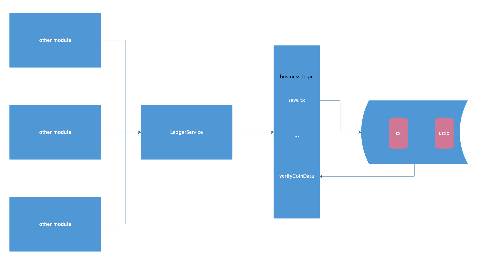
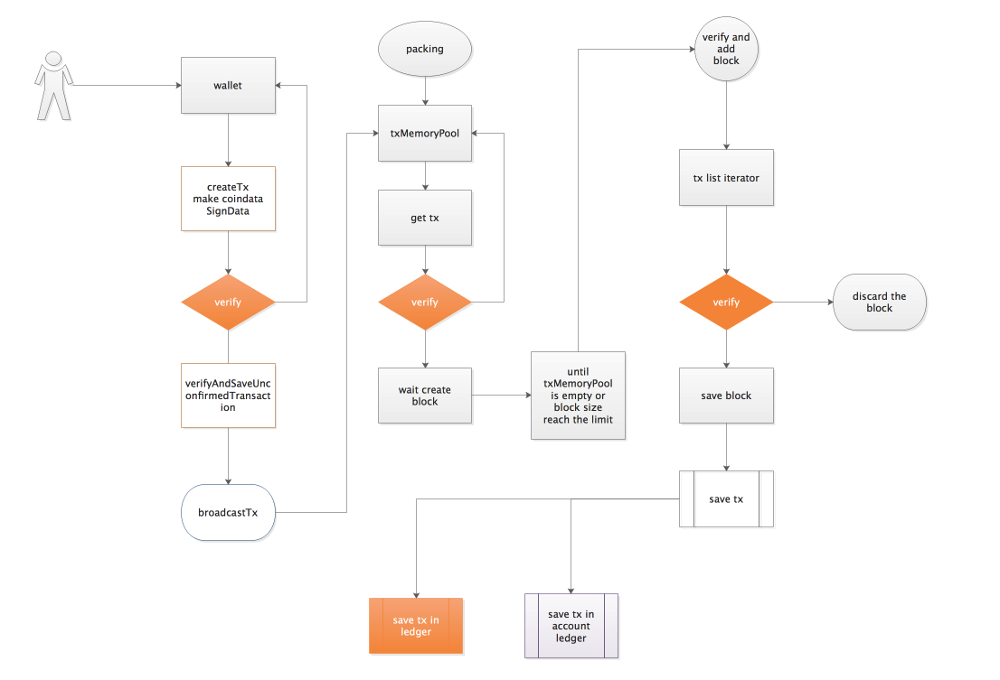
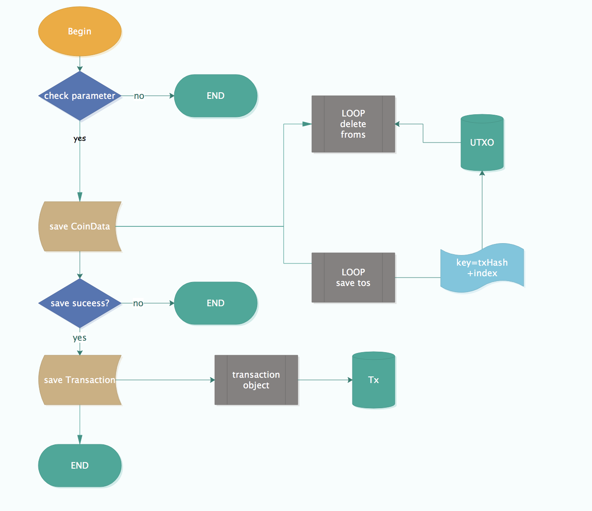
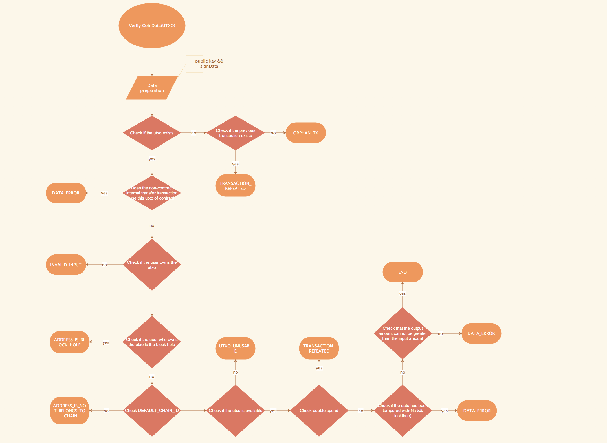

title: 账本模块解析
---

## 1、模块概述

`Legder-module`模块保存了全网所有的交易以及`UTXO`，数据完整、公开、透明。
> 正因如此，账本模块的主要作用是验证交易的合法性，如交易发出者必须拥有当前UTXO、UTXO未锁定即可用、输出不能大于输入、不能双花即不能重复支付。

>> 另账本模块可为回滚区块提供数据支撑。

## 2、模块协议

### 2.1 交易中`CoinData`数据结构[UTXO模型在NULS中的设计应用]

*以转账为例*

* **`CoinData`**

		List<Coin> froms

	> 表示转账发出者可用于转出的UTXO(可用资金)
	
		List<Coin> tos
	
	> 新生成的UTXO，表示转账金额以及找零给转账发出者的UTXO

	eg.
	
	账户A向账户B转账5个NULS，账户A有一个6NULS的UTXO，那么CoinData在不考虑手续费的情况下 
	
	> froms: 
	
	>> utxo-6-nuls-sender 
	
	> tos: 
	
	>> utxo-5-nuls-receiver 
	
	>> utxo-1-nuls-sender 
	
* **`Coin`**

		byte[] owner
		
	> 在*`List<Coin> froms`*中`owner`保存的是上一笔交易的txHash+index[tos这个List的index]，如何理解呢，概述为这个UTXO的来源，是某一笔交易中的`List<Coin> tos`其中之一，具体是第几个，由index来定位。
	
	>>  -
	
	> 在*`List<Coin> tos`*中`owner`保存的是转账接收者的账户地址
	
		Na na
	
	> 这笔UTXO所含资金
	
		long lockTime
	
	> 是否锁定，可按时间、区块高度锁定，例如创建交易后1小时后解锁，或者区块高度增加1000块后解锁

## 3、模块功能

### 3.1 验证交易

验证逻辑：*交易发出者必须拥有当前UTXO、UTXO未锁定即可用、输出不能大于输入、不能双花即不能重复支付*

* 本地钱包节点：创建交易后保存未确认交易时验证交易
* 出块节点：打包交易时验证交易
* 共识节点：接收区块后验证区块时验证交易

### 3.2 保存交易

保存逻辑：*维护交易中的`UTXO`，删除`from`中的`UTXO`即已花费，保存`to`中的`UTXO`即未花费，保存交易*

* 共识节点：区块验证通过后保存交易。

### 3.3 验证区块双花或者一个交易列表双花

验证逻辑：*把所有交易中的`fromUtxo`拿出来，查找是否存在重复，有则为双花*

* 共识节点：区块验证时
* 其他情况：需要对一个交易列表验证时

### 3.4 回滚交易

回滚逻辑：*保存交易的反向操作*

* 链分叉需要回滚区块时

### 3.5 查询功能

* 根据`txHash`获取交易
* 获取全网`UTXO`资金之和
* 根据`key`[txhash+index]获取UTXO


## 4、模块接口

### 4.1 接口定义类

```java
io.nuls.ledger.service.LedgerService
```

### 4.2 接口方法概述

* #### **_验证交易_**

	-

  * 代码

    ```java
    public ValidateResult verifyCoinData(Transaction transaction, Map<String, Coin> temporaryToMap, Set<String> temporaryFromSet);

    
    public ValidateResult verifyCoinData(Transaction transaction, Map<String, Coin> temporaryToMap, Set<String> temporaryFromSet, Long bestHeight);

    ```
  
  * 方法说明:

    验证交易发出者必须拥有当前UTXO、UTXO未锁定即可用、输出不能大于输入、不能双花即不能重复支付。

  * 参数说明:

		`Transaction transaction` 
> 待验证交易
		
		`Map<String, Coin> temporaryToMap` 
> 本次打包的交易所产生的`UTXO(List<Coin> tos)`依次装进`temporaryToMap`中，用于验证一个区块中连续交易所使用的`UTXO`的合法性，即在同一个区块中上一笔交易产生的`UTXO`在下一笔交易里被花费，由于待打包区块的交易还未保存进全账本中，所以在验证交易使用的`UTXO`是否存在时，先检查全账本中是否存在，若不存在，再检查`temporaryToMap`，若也不存在，则说明使用的`UTXO`是非法的。 
> 
> 每个交易验证通过后，把本次交易产生的UTXO也装进`temporaryToMap`中，用于下一笔交易的验证。 
		
		`Set<String> temporaryFromSet` 
> 本次打包的交易所花费的`UTXO(List<Coin> froms)`依次装进`temporaryFromSet`中，用于验证本区块中交易使用的UTXO是否双花即重复支付。 
> 
> 每个交易验证通过后，把本次花费的`UTXO(List<Coin> froms)`也装进`temporaryFromSet`中，用于下一笔交易的验证。
		
		`Long bestHeight` 
> 验证`UTXO(List<Coin> froms)`里的`UTXO`的锁定状态时，指定当前解锁的最高区块高度
    

  * 返回值说明:

		验证通过则返回成功，不附带数据
		
		验证失败则返回失败错误码，不附带数据

* #### **_保存交易_**

	-

  * 代码

    ```java
    Result saveTx(Transaction tx) throws NulsException;
    ```
  
  * 方法说明:

		验证区块通过后保存交易，维护交易中的`UTXO`，删除`from`中的`UTXO`即已花费，保存`to`中的`UTXO`即未花费，保存交易
    

  * 参数说明:

		`Transaction tx` 
> 待保存交易   

  * 返回值说明:

		保存成功则返回成功，不附带数据
		
		保存失败则返回失败错误码，不附带数据

* #### **_验证区块双花或者一个交易列表双花_**

	-
	
  * 代码

    ```java
    ValidateResult<List<Transaction>> verifyDoubleSpend(Block block);

    ValidateResult<List<Transaction>> verifyDoubleSpend(List<Transaction> txList);
    ```
  
  * 方法说明:

		把所有交易中的`fromUtxo`拿出来，查找是否存在重复，有则为双花    

  * 参数说明:

		`Block block` 
> 待验证区块
		
		`List<Transaction> txList`
> 待验证交易列表  

  * 返回值说明:

		验证成功则返回成功，不附带数据
		
		验证失败则返回失败错误码，同时附带数据data, 即双花的两条交易		
* #### **_回滚交易_**

	-
	
  * 代码

    ```java
	Result rollbackTx(Transaction tx) throws NulsException;
    ```
  
  * 方法说明:

		链分叉需要回滚区块时回滚交易

  * 参数说明:

		`Transaction tx` 
> 待回滚交易

  * 返回值说明:

		回滚成功则返回成功，不附带数据
		
		回滚失败则返回失败错误码，不附带数据
	
		
* #### **_查询交易_**

	-
	
  * 代码

    ```java
	Transaction getTx(NulsDigestData hash);
   Transaction getTx(byte[] txHashBytes);
    ```
  
  * 方法说明:

		根据交易hash查询交易

  * 参数说明:

		`NulsDigestData hash` 
> 交易hash对象	

		`byte[] txHashBytes`
> 交易hash字节数组

  * 返回值说明:

		返回交易对象或者空

* #### **_查询全网UTXO资金之和_**

	-
	
  * 代码

   ```java
	long getWholeUTXO();
	```
  
  * 方法说明:

		查询全网所有未花费的资金之和

  * 参数说明:

		无

  * 返回值说明:

		返回nuls的最小单位na

* #### **_根据key[txHash+index]查询UTXO_**

	-
	
  * 代码

	```java
	Coin getUtxo(byte[] owner);
	```
  
  * 方法说明:

		根据key[txHash+index]查询UTXO
		
  * 参数说明:

		`byte[] owner` 
> 产生这个UTXO的交易的txHash+index	


  * 返回值说明:

		返回Coin对象或者空

## 5、模块架构




## 6、核心流程

### 6.1 系统核心流程概览

> 账本模块的接口作为组件运用在系统其它流程中




### 6.2 账本模块核心流程

* 保存交易




* 验证UTXO


