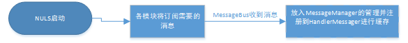
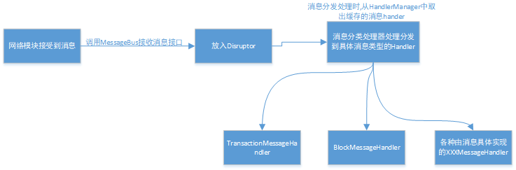

# NULS消息总线模块解析
---

## 1、模块概述

​	消息总线模块是NULS专门用来处理消息的功能性模块，管理着所有的网络消息和协议消息，并且提供消息的订阅、接收、发送等功能，是NULS各个节点的数据中转站。

## 2、模块功能

​	消息总线模块通过MessageManager消息管理器对NULS中所有消息进行统一的管理，提供了消息的订阅、取消订阅、广播消息、点对点发送消息、接收消息、创建消息示例等功能。

## 3、模块接口

- 接口定义类 `io.nuls.message.bus.service.MessageBusService`

```java

    /**
     * 订阅消息
     * Subscribe to message
     *
     * @param messageClass   需要订阅消息的 class对象
     * @param messageClass   The class object that needs to subscribe to the message.
     * @param messageHandler 消息处理器
     * @param messageHandler The message message
     * @return The id of the subscription message.
     */
    String subscribeMessage(Class<? extends BaseMessage> messageClass, NulsMessageHandler<? extends BaseMessage> messageHandler);


    /**
     * 取消订阅消息
     * unsubscribe
     *
     * @param subscribeId 订阅消息的id.
     * @param subscribeId The id of the message message.
     */
    void unsubscribeMessage(String subscribeId);

    /**
     * 接收消息, 把消息放至消息总线
     * Receive the message and place the message on the message bus.
     *
     * @param message 接收到的消息
     * @param message Received message.
     * @param node    节点, 该消息来自哪个节点.
     * @param node    The message comes as to which node.
     */
    void receiveMessage(BaseMessage message, Node node);

    /**
     * 广播消息
     * broadcast to nodes except "excludeNode"
     *
     * @param message     The message was broadcast.
     * @param excludeNode 不会广播的节点 The node that is not passed.
     * @param aysn        是否异步 Asynchronous execution
     * @return Return all broadcasted node id list
     */
    Result<List<String>> broadcast(BaseMessage message, Node excludeNode, boolean aysn, int percent);


    /**
     * 发送消息到一个节点
     * send msg to one node
     *
     * @param message The message you want to sent
     * @param node    The node that received the message
     * @param aysn    是否异步 Asynchronous execution
     * @return Return whether sent successfully
     */
    Result sendToNode(BaseMessage message, Node node, boolean aysn);

    /**
     * 根据消息类型和模块标识实例化一个消息对象
     * Instantiate a message object based on message type and module identity.
     */
    Result<? extends BaseMessage> getMessageInstance(short moduleId, int type);
```

## 4、模块架构

- 模块名称：message-bus-module
- 模块ID：6


## 5、核心流程

#### 5.1 模块启动-订阅消息




#### 5.2 接收消息-分类处理器处理-分发到具体消息handler进行处理


