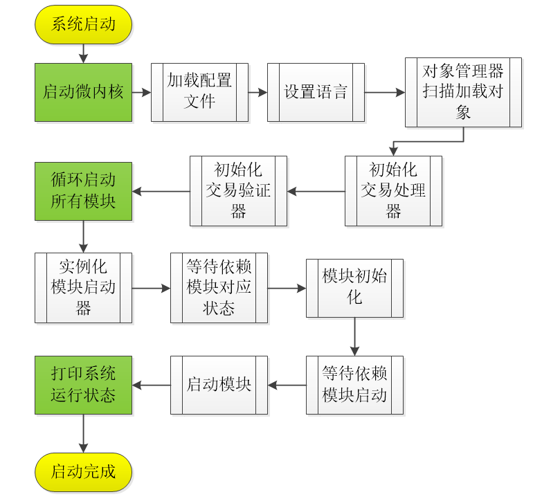

# 第三章 微内核模块解析

[TOC]

## 1、模块概述

微内核模块是NULS的核心模块，负责系统的模块管理、对象管理、线程管理、服务管理、配置管理等核心功能，

## 2、模块功能

### 2.1 配置管理

微内核模块负责系统配置文件的读取和存储，各个模块需要使用时，只需要调用配置管理器来获取需要的配置项信息。

配置支持properties和ini两种格式。

### 2.2 上下文管理

微内核模块提供了系统的上下文容器NulsContext，通过上下文容器可以获取到最新区块、创世块、网络高度、链id、默认地址类型，上下文中还提供了服务管理器的获取服务对象的快捷访问方式。

### 2.3 模块管理

微内核模块定义了模块启动器的抽象类BaseModuleBootstrap，模块需要继承该抽象类才能把模块加入到管理中。模块管理器管理所有模块的生命周期，包括加载、初始化、运行、停止、销毁。微内核模块还要维护模块的依赖关系，控制模块的启动顺序。

### 2.4 对象管理

类似spring-framework的IOC容器，通过注解的方式实现对象的实例化，并对对象进行管理。对对应的方法进行拦截验证，如果调用的对象所在的模块尚未运行，则不允许执行。

### 2.5 线程管理

微内核模块提供线程管理器TaskManager，可以创建并允许线程或线程池。提供默认的线程创建工厂NulsThreadFactory，所有线程都应该用该工厂进行创建。

### 2.6 服务管理

NULS中的所有的服务，都注册到服务管理器中，服务间相互依赖可以通过注解的方式进行引用，也可以通过NulsContext上下文管理器来获取。

### 2.7 国际化

微内核模块提供了基础的国际化方案，通过不同的配置文件（zh-CN.properties,en.properties)实现语言的切换，任意语言都可以通过配置文件的方式加入nuls系统中。

## 3、模块接口

### 3.1 设置语言

接口定义类：

```
io.nuls.kernel.service.KernelService
```

- 获取创世块

  - 方法说明:

    设置系统语言，

  - 参数说明:

    lang(String):国际化配置文件的前缀，如英文en.properties配置的key就是"en"

  - 返回值说明:

    success(boolean):操作是否成功

  - 代码

    ```
      /**
         * 设置系统语言
         * set language of system
         *
         * @param lang zhe name of the language properties file
         * @return success or not
         */
        public Result setLanguage(String lang);
    ```

### 3.2 线程接口

接口定义类：

```
io.nuls.kernel.thread.manager.TaskManager
```

- 创建线程池

  - 方法说明:

    根据传入的参数创建一个线程池，并返回

  - 参数说明:

    threadCount（int）：线程数量

    queueSize（int）：队列数量

    factory（NulsThreadFactory）：线程创建工厂对象

  - 返回值说明:

    data:返回创建的线程池对象

  - 代码

    ```
    /**
         * 创建一个线程池，并返回
         * create a thread pool and return it;
         * @param threadCount the max count of thread 
         * @param queueSize the max size of the queue
         * @param factory which create all the threads
         * @return the thread pool
         */
        public static final ThreadPoolExecutor createThreadPool(int threadCount, int queueSize, NulsThreadFactory factory) 
    ```

- 创建定时任务线程池

  - 方法说明:

    根据传入的参数创建一个定时任务线程池，并返回

  - 参数说明:

    threadCount（int）：线程数量

    factory（NulsThreadFactory）：线程创建工厂对象

  - 返回值说明:

    data:返回创建的线程池对象

  - 代码

    ```
    /**
         * 创建一个定时执行的线程池，并返回
         * create a scheduled thread pool and return it;
         * @param threadCount the max count of thread
         * @param factory which create all the threads
         * @return the thread pool
         */
        public static final ScheduledThreadPoolExecutor createScheduledThreadPool(int threadCount, NulsThreadFactory factory) ;
    ```

- 异步方法执行

  - 方法说明:

    异步的方式调用一个run方法，所有以这种方式调用的方法共用同一个线程池。

  - 参数说明:

    runnable（Runnable）：run

  - 返回值说明:

    void

  - 代码

    ```
    	/**
         * 异步执行一个方法，该方法会在系统中一个特定的线程池中异步执行，
         * 该线程池为系统中所有该类的调用者共享。
         * A method is executed asynchronously, which is executed asynchronously in a specific 
         * thread pool in the system, which is shared by all callers of this class in the system.
         * @param runnable 可以行的run方法对象，Run method object
         */
        public static final void asynExecuteRunnable(Runnable runnable)
    ```

- 创建独立线程并运行

  - 方法说明:

    根据传入的参数创建一个线程，

  - 参数说明:

    moduleId（short）：模块id

    threadName（String）：线程名称

    runnable（Runnable）：执行方法对象

    deamon（boolean）：是否创建守护进程

  - 返回值说明:

    void

  - 代码

    ```
     /**
         * 创建一个独立的线程，并执行runnable的run方法
         * Create a separate thread and execute the runnable run method
         * @param moduleId 模块id
         * @param threadName 线程名称
         * @param runnable 方法对象
         * @param deamon     是否是守护线程
         */
        public static final void createAndRunThread(short moduleId, String threadName, Runnable runnable, boolean deamon) 
    ```

- 停止一个模块的所有线程

  - 方法说明:

    根据传入的模块id停止该模块的所有线程

  - 参数说明:

    moduleId（short）：模块id

  - 返回值说明:

    void

  - 代码

    ```
        /**
         * 停止一个模块的所有线程
         * stop all the threads of the module
         * @param moduleId 模块id
         */
        public static void shutdownByModuleId(short moduleId)
    ```

## 4、模块架构

```
1、微内核模块是整个NULS系统的“主板”，所有模块都是插在主板上的
2、模块间通信、功能调用都依赖于“主板”
3、“主板”提供管理和协同的作用
```

## 5、模块协议

略

## 6、核心流程

### 6.1 系统启动



