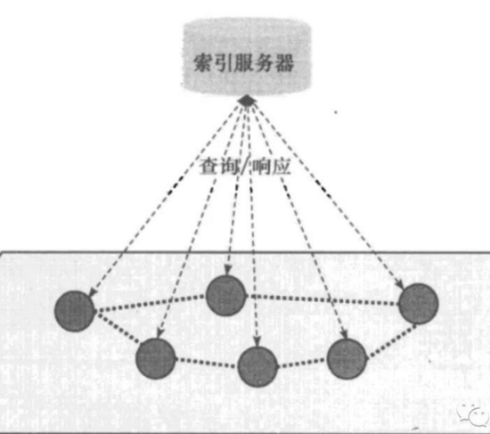
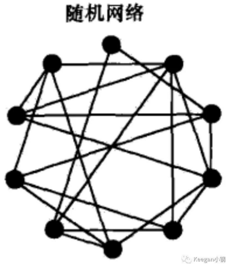
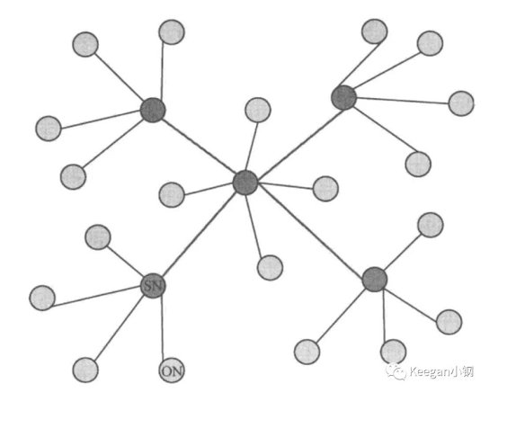
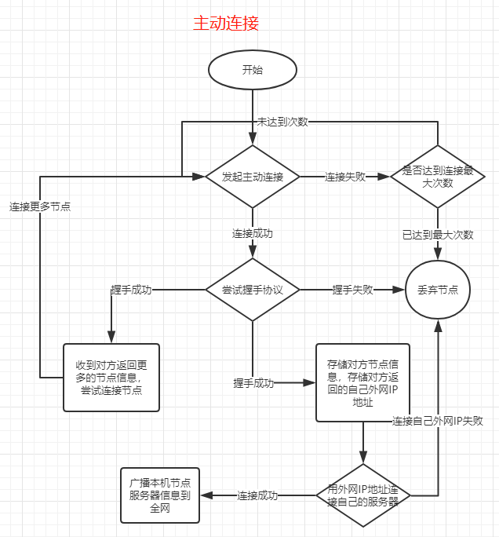
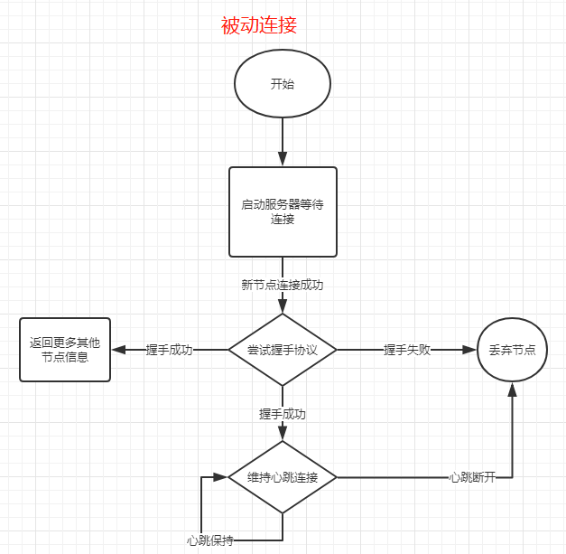
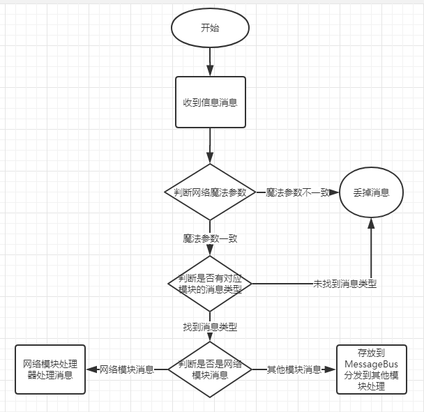
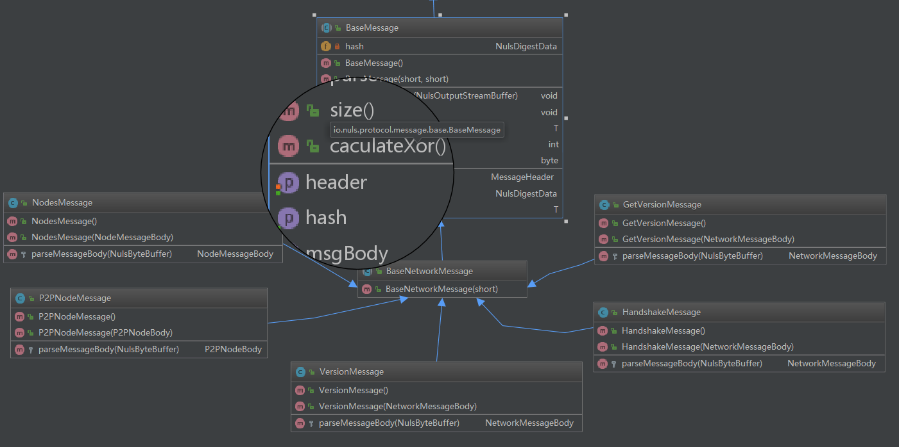

title: 网络模块
---

## 模块概述

​        网络模块为NULS八大基础模块之一，提供最底层的网络通信、节点发现等服务。区块链的网络基础就是Peer to Peer,即P2P。P2P网络中的所有参与者，可以是提供服务（server），也可以是资源使用者（client）。P2P网络的特点：非中心化、可扩展性、健壮性、高性价比、隐私保护、负载均衡。

根据结构关系可以将P2P系统细分为四种拓扑形式：

- 中心化拓扑（Centralized Topology）：即存在一个中心节点保存了其他所有节点的索引信息，索引信息一般包括节点 IP 地址、端口、节点资源等；

  

- 全分布式非结构化拓扑（Decentralized Unstructured Topology）：移除了中心节点，在 P2P 节点之间建立随机网络，就是在一个新加入节点和 P2P 网络中的某个节点间随机建立连接通道，从而形成一个随机拓扑结构。比特币采用的是该网络结构；

  

- 全分布式结构化拓扑（Decentralized Structured Topology，也称作DHT网络）：将所有节点按照某种结构进行有序组织，比如形成一个环状网络或树状网络。而结构化网络的具体实现上，普遍都是基于 DHT(Distributed Hash Table，分布式哈希表) 算法思想。比如以太坊网络的实现算法Kademlia；

  

- 半分布式拓扑（Partially Decentralized Topology）：吸取了中心化结构和全分布式非结构化拓扑的优点，选择性能较高（处理、存储、带宽等方面性能）的结点作为超级结点（英文表达为SuperNodes或者Hubs），在各个超级结点上存储了系统中其他部分结点的信息，发现算法仅在超级结点之间转发，超级结点再将查询请求转发给适当的叶子结点。半分布式结构也是一个层次式结构，超级结点之间构成一个高速转发层，超级结点和所负责的普通结点构成若干层次。EOS采用的就是该网络结构。

  

​        NULS1.0版本类似于比特币采用的是第二种，全分布式非结构化拓扑。网络中的节点具有功能有：路由、钱包、挖矿、区块链数据库。所有的节点都具有路由功能，参与校验和广播交易及区块信息，且会发现和维持与其他节点的连接。


**模块信息**
​	
​	模块名称：network-module
​	
​	模块结构：模块顶级目录network-module，consesnus工程为模块接口定义，base目录下为网络模块的默认实现，实现工程network-base，network-protocol实现相关网络协议，network-storage网络存储接口和实现。
​	
​	接口定义依赖模块：**protocol-module、network-module**
​	
​	实现额外依赖模块：**core-module、ledger-module、account-module、account-ledger-module**

## 二 模块功能

本小节会详细描述网络模块的功能需求和每一个功能点限制条件，以及NULS1.0版本的默认实现方式。

### 1.节点发现

​	功能需求：NULS的每一个节点既是服务器，可接受其他节点的连接；同时也是客户端，会主动向其他节点发起连接。节点之间会相互询问更多的节点，并尝试连接，每个节点都尽量保证自己连接到更多的节点且相互通信。

​	实现方式：NULS1.0版本默认采用Netty框架实现。运行节点时，网络模块会启动网络服务(NettySever)，等待其他节点的连接，同时也会主动连接其他节点(NettyClient)。主动连接的节点，我们称为主动节点，同一IP地址不能重复发起主动连接；网络服务接收到的新节点，我们称为被动节点，考虑到有局域网内节点对外暴露的公网IP一致，因此被动节点运行统一IP地址最多有10个连接。

​	主动节点连接成功后，对方会返回更多其他可连接节点信息，收到节点信息后，再依次尝试主动连接这些节点。直到达到配置的主动连接最大值为止。

​	NULS1.0版本提供了7个种子节点，有新节点第一次运行时会连接7个种子节点。种子节点会返回新节点的外网IP地址，新节点会尝试通过外网IP主动连接自己的服务器，如果连接成功，则会主动发送一条新节点消息到网络中，其他节点收到消息后，会尝试连接新节点。

### 2.消息接收与处理

​	功能需求：节点会收到其他节点的发送的消息。收到的消息首先通过NULS的网络协议过滤，过滤后的消息再交由各个模块处理。

​	实现方式：NULS所发送的消息包含消息头(MessageHeader)和消息体(MessageBody)，消息头内包含魔法参数，消息对应的模块ID和消息类型。在接收到其他节点发送的消息后，首先判断魔法参数是否一致，再判断模块ID和消息类型是否存在，不一致的消息直接过滤。

​	过滤后的消息，有网络模块的协议，则由网络模块自己处理。非网络模块协议，统一放到分发器里，由分发器分发给其他模块，通过自定义的反序列化方法将MessageBody转换成业务数据再做相应处理。

### 3.消息广播

​	功能需求：由节点产生的协议（区块、交易等）会通过网络模块发送到已连接并握手成功的其他节点。

​	实现方式：网络模块提供了广播消息的接口，接口会将所有消息都添加上对应模块的消息头，再通过自定义的序列化方法转换成网络信息，发送到其他节点。

### 4.节点分组

​	功能需求：已连接的对等节点，可根据不同的属性与功能，存放在不同的节点组里方便管理。例如按照连接情况分为主动连接组、被动连接组、按照功能可分为共识节点组、普通节点组。

​	实现方式：网络模块提供了节点分组功能，并提供了创建节点组、添加节点到节点组、获取节点组等接口。当前网络模块默认创建了主动连接组和被动连接组。


## 三 模块接口

网络模块的外部接口定义类为io.nuls.network.service.NetworkService

```
/**
* 断开一个已连接的节点
* Disconnect the connection with the node
*
* @param nodeId the id of node
*/
void removeNode(String nodeId);

/**
* 获取一个节点
* get node by id
*
* @param nodeId the id of node
* @return Node
*/
Node getNode(String nodeId);

/**
* 获取所有节点
* get all nodes
*
* @return Map
*/
Map<String, Node> getNodes();

/**
* 获取已连接的节点
* get connected nodes
*
* @return Collection
*/
Collection<Node> getAvailableNodes();

/**
* 获取可连接的节点
* get connectable nodes
*
* @return List
*/
List<Node> getCanConnectNodes();

/**
* 根据名字获取节点组
* get NodeGroup by name
*
* @param  groupName groupName
* @return NodeGroup
*/
NodeGroup getNodeGroup(String groupName);

/**
* 发送消息
* Send message to all connected nodes
*
* @param nulsData message
* @param asyn     Whether or not asynchronous
* @return BroadcastResult
*/
BroadcastResult sendToAllNode(BaseNulsData nulsData, boolean asyn, int percent);

/**
* 发送消息
* Send message to all connected nodes
*
* @param event event
* @param excludeNode node that does not need to be send
* @param asyn Whether or not asynchronous
* @param percent percent of nodes count
* @return BroadcastResult
*/
BroadcastResult sendToAllNode(BaseNulsData event, Node excludeNode, boolean asyn, int percent);

/**
* send message to node
*
* @param event event
* @param node node
* @param asyn  Whether or not asynchronous
* @return BroadcastResult
*/
BroadcastResult sendToNode(BaseNulsData event, Node node, boolean asyn);

/**
* 发送消息给节点组
* send message to nodeGroup
*
* @param  event event
* @param groupName groupName
* @param asyn asyn
* @return BroadcastResult
*/
BroadcastResult sendToGroup(BaseNulsData event, String groupName, boolean asyn);

/**
* 重置网络
* reset network module
*/
void reset();

/**
* 获取网络配置信息
* Get network configuration information
*
* @return NetworkParam
*/
NetworkParam getNetworkParam();
```


## 四 模块协议

网络模块，协议模块ID = 4

```
short NETWORK_MODULE_ID = 4;
```


- Node            p2p节点信息

| 尺寸   | 字段          | 数据类型      | 说明     |
| ---- | ----------- | --------- | ------ |
| 4    | magicNumber | uint32    | 魔法参数   |
| 2    | port        | uint16    | 服务监听端口 |
| ??   | IP          | VarString | 节点IP   |

- HandshakeMessage                  节点握手信息

| 尺寸   | 字段              | 数据类型      | 说明            |
| ---- | --------------- | --------- | ------------- |
| 2    | handshakeType   | uint16    | 1. 请求   2. 响应 |
| 2    | ServerPort      | uint16    | 服务监听端口        |
| 4    | BestBlockHeight | uint32    | 最高高度          |
| ??   | BestBlockHash   | VarString | 最高块Hash字符串    |
| 6    | networkTime     | uint48    | 网络时间          |
| ??   | nodeIp          | VarString | 对方网络地址        |
| ??   | Version         | VarString | 版本字符串         |

- P2PNodeMessage                  新节点广播信息

| 尺寸   | 字段   | 数据类型      | 说明     |
| ---- | ---- | --------- | ------ |
| 2    | Port | uint16    | 服务监听端口 |
| ??   | IP   | VarString | 节点IP   |

- NodesMessage                      节点集合信息

| 尺寸   | 字段        | 数据类型            | 说明     |
| ---- | --------- | --------------- | ------ |
| ??   | NodeCount | VarInt          | 节点数    |
| ??   | Node[]    | Node[NodeCount] | 节点信息数组 |

- GetVersionMessage             获取节点版本信息

| 尺寸   | 字段              | 数据类型      | 说明            |
| ---- | --------------- | --------- | ------------- |
| 2    | handshakeType   | uint16    | 1. 请求   2. 响应 |
| 2    | ServerPort      | uint16    | 服务监听端口        |
| 4    | BestBlockHeight | uint32    | 最高高度          |
| ??   | BestBlockHash   | VarString | 最高块Hash字符串    |
| 6    | networkTime     | uint48    | 网络时间          |
| ??   | nodeIp          | VarString | 对方网络地址        |
| ??   | Version         | VarString | 版本字符串         |

- NETWORK_VERSION

| 尺寸   | 字段              | 数据类型      | 说明            |
| ---- | --------------- | --------- | ------------- |
| 2    | handshakeType   | uint16    | 1. 请求   2. 响应 |
| 2    | ServerPort      | uint16    | 服务监听端口        |
| 4    | BestBlockHeight | uint32    | 最高高度          |
| ??   | BestBlockHash   | VarString | 最高块Hash字符串    |
| 6    | networkTime     | uint48    | 网络时间          |
| ??   | nodeIp          | VarString | 对方网络地址        |
| ??   | Version         | VarString | 版本字符串         |


## 五 模块架构


## 六 核心流程

#### 6.1发现节点、建立连接

​	NULS的每个节点既是客户端又是服务器，因此发现节点、建立连接需要从主动发起连接访问其他节点的服务器，和被动等待其他人连接自己的服务器两个方面进行描述。






#### 7.2消息的接收与处理

​	

## 7 模块类图


