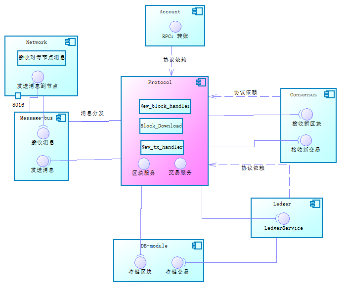
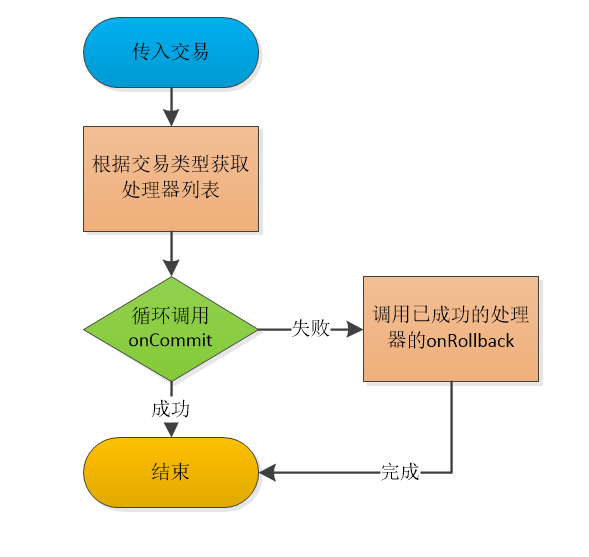
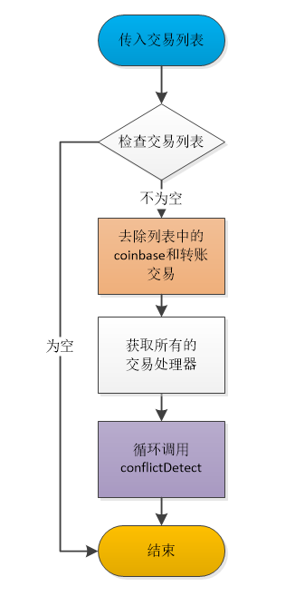

title: 通用协议
-----------

## 1、模块概述

​	Protocol-module模块的设计初衷是为所有模块定义通用的协议格式，所有的模块可以通过依赖协议模块来使用这些通用的协议。在定义这些通用协议的同时，协议模块还提供了这些协议相关的通用验证器、通用处理器和一些重要数据结构的服务接口。

## 2、模块功能

### 2.1 协议定义

* 交易协议:共识奖励交易、转账交易、数据链上存储交易，以及交易的验证器
* 网络协议及处理器:节点间发送、获取小区快、区块、交易的消息和处理器的定义与实现。

### 2.2 其他功能

* 区块同步:从网络对等节点处获取当前最新区块高度信息，并下载和存储区块。
* 区块管理:接收新区块、存储区块、回滚区块、查询区块和区块头信息、广播区块。
* 交易管理:接收交易、交易确认、交易回滚、查询交易、交易冲突检测。

## 3、模块接口

### 3.1 区块接口

接口定义类:

```
io.nuls.protocol.service.BlockService
```

* 获取创世块

  * 方法说明:

    从数据库中获取高度为0的区块，先从数据库中获取区块头，再通过LedgerService获取区块中的交易，最后组装完整的区块，放入返回结果中。

  * 参数说明:

    无

  * 返回值说明:

    data:返回完整的区块信息，当查询不到数据时，返回失败的结果

  * 代码

    ```
    /**
     * 获取创世块（从存储中）
     * Get the creation block (from storage)
     */
    Result<Block>  getGengsisBlock();
    ```

* 获取最新块

  - 方法说明:

    从数据库中获取最大高度，根据高度查询区块头，再通过LedgerService获取区块中的交易，最后组装完整的区块，放入返回结果中。

  - 参数说明:

    无

  - 返回值说明:

    data:返回完整的区块信息，当查询不到数据时，返回失败的结果

  - 代码

    ```
    /**
     * 获取最新的区块（从存储中）
     * Get the highest block (from storage)
     */
    Result<Block> getBestBlock();
    ```

* 获取最新区块头

  - 方法说明:

    从数据库中获取最大高度，根据高度查询区块头并返回。

  - 参数说明:

    无

  - 返回值说明:

    data:返回区块头信息，当查询不到数据时，返回失败的结果

  - 代码

    ```
    /**
     * 获取最新的区块头（从存储中）
     * Get the highest block header (from storage)
     */
    Result<BlockHeader> getBestBlockHeader();
    ```

* 根据高度获取区块头

  - 方法说明:

    根据高度查询区块hash，再通过hash获取区块头信息

  - 参数说明:

    区块高度（long）

  - 返回值说明:

    data:返回区块头信息，当查询不到数据时，返回失败的结果

  - 代码

    ```
    /**
     * 根据区块高度获取区块头（从存储中）
     * Get the block head (from storage) according to the block height
     *
     * @param height 区块高度/block height
     * @return 区块头
     */
    Result<BlockHeader> getBlockHeader(long height);
    ```

* 根据区块Hash获取区块头

  - 方法说明:

    根据hash查询区块头，放入返回结果中。

  - 参数说明:

    区块hash（NulsDigestHash）

  - 返回值说明:

    data:返回区块头信息，当查询不到数据时，返回失败的结果

  - 代码

    ```
    /**
     * 根据区块摘要获取区块头（从存储中）
     * Get the block head (from storage) according to the block hash
     *
     * @param hash 区块摘要/block hash
     * @return 区块头/block header
     */
    Result<BlockHeader> getBlockHeader(NulsDigestData hash);
    ```

* 根据高度获取区块

  - 方法说明:

    根据高度查询区块hash，再通过hash获取区块头信息，再通过LedgerService获取区块中的交易，最后组装完整的区块，放入返回结果中。

  - 参数说明:

    区块高度（long）

  - 返回值说明:

    data:返回完整的区块信息，当查询不到数据时，返回失败的结果

  - 代码

    ```
    /**
     * 根据区块高度获取区块（从存储中）
     * Get the block (from storage) according to the block height
     *
     * @param height 区块高度/block height
     * @return 区块/block
     */
    Result<Block> getBlock(long height);
    ```

* 根据Hash获取区块

  - 方法说明:

    根据hash获取区块头信息，再通过LedgerService获取区块中的交易，最后组装完整的区块，放入返回结果中。

  - 参数说明:

    区块hash（NulsDigestHash）

  - 返回值说明:

    data:返回完整的区块信息，当查询不到数据时，返回失败的结果

  - 代码

    ```
    /**
     * 根据区块摘要获取区块（从存储中）
     * Get the block (from storage) according to the block hash
     *
     * @param hash 区块摘要/block hash
     * @return 区块/block
     */
    Result<Block> getBlock(NulsDigestData hash);
    ```

* 保存区块

  - 方法说明:

    先确认交易、再存储交易，再存储区块头，最后处理本地未确认交易。上述步骤任何一步失败，都会将前面已处理的步骤回滚。

  - 参数说明:

    区块（Block)

  - 返回值说明:

    success:返回区块是否存储成功

  - 代码

    ```
    /**
     * 保存区块到存储中
     * Save the block to the store.
     *
     * @param block 完整区块/whole block
     * @return 操作结果/operating result
     * @throws NulsException 保存区块有可能出现异常，请捕获后谨慎处理
     * There may be exceptions to the save block, please handle it carefully after capture.
     */
    Result saveBlock(Block block) throws NulsException;
    ```

* 回滚区块

  - 方法说明:

    先回滚交易，在删除区块头，最后处理本地交易。上述步骤任何一步失败，都会将前面已处理的步骤反向操作。

  - 参数说明:

    区块（Block)

  - 返回值说明:

    success:返回区块是否回滚成功

  - 代码

    ```
    /**
     * 回滚区块
     * roll back the block to the store.
     *
     * @param block 完整区块/whole block
     * @return 操作结果/operating result
     * @throws NulsException 回滚区块有可能出现异常，请捕获后谨慎处理
     * There may be exceptions to the roll back block, please handle it carefully after capture.
     */
    Result rollbackBlock(Block block) throws NulsException;
    ```

* 广播区块

  - 方法说明:

    将小区块放在区块广播消息中，通过调用MessageBus模块的接口将消息发送到网络中。

  - 参数说明:

    smallBlock:小区块（SmallBlock)

  - 返回值说明:

    success:返回区块是否广播成功

    data:发送成功的节点id列表

  - 代码

    ```
    /**
     * 广播区块给连接的其他对等节点
     * The broadcast block gives the connection to other peers.
     *
     * @param block 完整区块/the whole block
     * @return 广播结果/Broadcast the results
     */
    Result broadcastBlock(SmallBlock block);
    ```

* 转发区块

  - 方法说明:

    根据区块组装小区块，并将小区块放在转发消息中，通过调用MessageBus模块的接口将消息发送到网络中。

  - 参数说明:

    block:区块（Block)

    excludeNode:除外的节点（Node)

  - 返回值说明:

    success:返回区块是否转发成功

    data:发送成功的节点id列表

  - 代码

    ```
    /**
     * 转发区块给连接的其他对等节点，允许一个列外（不转发给它）
     * Forward block to other peers of the connection, allowing one column (not forward to it)
     *
     * @param hash       区块摘要/the hash of block
     * @param excludeNode 需要排除的节点，一般是因为从该节点处接收的本区块
     *                    The nodes that need to be excluded are generally due to the block received from the node.
     * @return 转发结果/forward results
     */
    Result forwardBlock(NulsDigestData hash, Node excludeNode);
    ```

### 3.2 交易接口

接口定义类:

```
io.nuls.protocol.service.TransactionService
```

* 确认交易

  - 方法说明:

    根据传入的交易类型，获取交易的处理器（processor），调用所有处理器的onCommit方法，任何一个处理器返回失败，则回滚已成功的处理器。

  - 参数说明:

    tx:交易（Transaction)

    secondaryData:辅助数据（Object)

  - 返回值说明:

    success:返回交易是否确认成功

  - 代码

    ```
    /**
     * 确认交易时调用的方法，对交易相关的业务进行提交操作
     * Identify the method that is invoked during the transaction and submit the transaction related business.
     *
     * @param tx            操作的交易/The transaction of the operation
     * @param secondaryData 辅助数据（可以为空）/Secondary data (available for null)
     * @return 操作结果/operating results
     */
    Result commitTx(Transaction tx, Object secondaryData);
    ```

* 回滚交易

  * 方法说明:

    根据传入的交易类型，获取交易的处理器（processor），调用所有处理器的onRollback方法，最后再删除该交易。任何一个流程返回失败，则回滚已成功的操作。

  * 参数说明:

    tx:交易（Transaction)

    secondaryData:辅助数据（Object)

  * 返回值说明:

    success:返回交易是否回滚成功

  * 代码

    ```
    /**
     * 回滚交易时调用的方法，对交易相关的业务进行回退操作
     * The method invoked when the transaction is rolled back and the transaction related business is returned.
     *
     * @param tx            操作的交易/The transaction of the operation
     * @param secondaryData 辅助数据（可以为空）/Secondary data (available for null)
     * @return 操作结果/operating results
     */
    Result rollbackTx(Transaction tx, Object secondaryData);
    ```

* 转发交易

  - 方法说明:

    将传入的交易，放入交易转发消息中，通过调用Message-Bus模块接口，将交易发送到网络中。

  - 参数说明:

    tx:交易（Transaction)

    excludeNode:需要排除的节点（Node)

  - 返回值说明:

    success:返回交易是否转发成功

    data:成功发送的节点id列表

  - 代码

  ```
  /**
   * 转发交易给连接的其他对等节点，允许一个列外（不转发给它）
   * Forward Transaction to other peers of the connection, allowing one column (not forward to it)
   *
   * @param tx          完整交易/the whole transaction
   * @param excludeNode 需要排除的节点，一般是因为从该节点处接收的本交易/The nodes that need to be excluded are generally
   *                    due to the transaction received from the node.
   * @return 转发结果/forward results
   */
  Result forwardTx(Transaction tx, Node excludeNode);
  ```

* 广播交易

  - 方法说明:

    将传入的交易，放入交易广播消息中，通过调用Message-Bus模块接口，将交易发送到网络中。

  - 参数说明:

    tx:交易（Transaction)

  - 返回值说明:

    success:返回交易是否转发成功

    data:成功发送的节点id列表

  - 代码

    ```
    /**
     * 广播交易给连接的其他对等节点
     * The broadcast transaction gives the connection to other peers.
     *
     * @param tx 完整交易/the whole transaction
     * @return 广播结果/Broadcast the results
     */
    Result broadcastTx(Transaction tx);
    ```

* 接收新交易

  - 方法说明:

    将传入的交易，传入共识服务中。

  - 参数说明:

    tx:交易（Transaction)

  - 返回值说明:

    success:共识模块是否处理成功

  - 代码

    ```
    /**
     * 将交易缓存到共识交易池
     * cache the transaction for consensus
     *
     * @param tx transaction
     * @return Result
     */
    Result newTx(Transaction tx);
    ```

* 冲突检测

  - 方法说明:

    获取所有的交易处理器（processor），调用所有处理器的conflictDetect方法，任何一个处理器返回失败，则直接返回失败的结果对象

  - 参数说明:

    txList:交易（List<Transaction>)

  - 返回值说明:

    success:返回交易是否冲突

    data:返回的辅助数据

  - 代码

    ```
    /**
     * 冲突检测，检测如果传入的交易列表中有相冲突的交易，则返回失败，写明失败原因及所有的应该舍弃的交易列表
     * <p>
     * Conflict detection, which detects conflicting transactions in the incoming transaction list, returns failure,
     * indicating the cause of failure and all the list of trades that should be discarded.
     *
     * @param txList 需要检查的交易列表/A list of transactions to be checked.
     * @return 操作结果：成功则返回successResult，失败时，data中返回丢弃列表，msg中返回冲突原因
     * Operation result: success returns successResult. When failure, data returns the discard list,
     * and MSG returns the cause of conflict.
     */
    ValidateResult conflictDetect(List<Transaction> txList);
    ```

* 获取交易

  - 方法说明:

    根据传入的交易hash，调用共识服务的接口，返回内存中的交易数据。

  - 参数说明:

    hash:交易hash（NulsDigestData)

  - 返回值说明:

    data:交易数据

  - 代码

    ```
    /**
     * 根据交易hash获取交易信息
     * get transaction by tx hash
     * @param hash
     * @return
     */
    Transaction getTx(NulsDigestData hash);
    ```


### 3.3 区块同步服务接口

接口定义类:

```
io.nuls.protocol.service.DownloadService
```

- 下载区块

  - 方法说明:

    根据区块hash从指定节点处下载一个区块

  - 参数说明:

    hash:区块hash（NulsDigestData)

    node:节点（Node）

  - 返回值说明:

    success:返回是否下载成功

    data:返回的区块数据（Block）

  - 代码

    ```
    /**
     * 从指定节点处根据hash下载一个区块，下载过程中线程是阻塞的
     * Download a block according from the node to the hash, and the download process is blocked.
     *
     * @param hash 区块摘要/block hash
     * @param node 指定的节点/Specified node
     * @return 区块及结果/ block  results
     */
    Result<Block> downloadBlock(NulsDigestData hash, Node node);
    ```

- 是否同步成功

  - 方法说明:

    获取当前同步状态，并判断是否是同步成功。

  - 参数说明:

    无

  - 返回值说明:

    success:返回是否已同步成功

  - 代码

    ```
    /**
     * 返回下载是否完成的结果
     * Returns the results of the download.
     * @return Result
     */
    Result isDownloadSuccess();
    ```

- 重置区块同步状态

  - 方法说明:

    检查当前状态是否需要下载区块，如果需要就下载。实现方式是将下载状态改为等待下载。

  - 参数说明:

    无

  - 返回值说明:

    success:返回操作是否成功

  - 代码

    ```
    /**
     * 重新检查当前状态是否需要重新同步区块，如果需要则下载
     * Recheck whether the current state needs to be resynchronized, and download if necessary.
     * @return Result
     */
    Result reset();
    ```

## 4、模块架构

### 4.1 模块上下文

a. 协议模块给其他模块提供通用协议的定义

b. 协议模块负责区块和交易的接收和同步功能



### 4.2 模块架构图


## 5、模块协议

### 5.1 模块交易

 通用交易数据结构

- 转账交易
- CoinBase交易

| 尺寸 | 字段       | 数据类型 | 说明           |
| ---- | ---------- | -------- | -------------- |
| 2    | type       | uint16   | 交易类型       |
| 6    | time       | uint48   | 时间戳         |
| ??   | remark     | VarByte  | 备注           |
| ??   | txData     | ??       | 交易数据       |
| ??   | coinData   | ??       | 代币数据       |
| ??   | scriptSign | VarByte  | P2PKHScriptSig |

- 数据承载交易

| 尺寸 | 字段       | 数据类型 | 说明           |
| ---- | ---------- | -------- | -------------- |
| 2    | type       | uint16   | 交易类型       |
| 6    | time       | uint48   | 时间戳         |
| ??   | remark     | VarByte  | 备注           |
| ??   | txData     | VarByte  | 交易数据       |
| ??   | coinData   | ??       | 代币数据       |
| ??   | scriptSign | VarByte  | P2PKHScriptSig |

###  5.2 模块消息

#### PROTOCOL_NOT_FOUND

| 尺寸 | 字段 | 数据类型     | 说明               |
| ---- | ---- | ------------ | ------------------ |
| 1    | type | NotFoundType | 未找到的类型       |
| ??   | Hash | VarString    | 请求但未找到的hash |

#### PROTOCOL_NEW_TX

| 尺寸 | 字段        | 数据类型    | 说明 |
| ---- | ----------- | ----------- | ---- |
| ??   | transaction | Transaction |      |

#### PROTOCOL_GET_BLOCK

| 尺寸 | 字段      | 数据类型       | 说明     |
| ---- | --------- | -------------- | -------- |
| ??   | blockHash | NulsDigestData | 区块hash |

#### PROTOCOL_BLOCK

| 尺寸 | 字段          | 数据类型        | 说明         |
| ---- | ------------- | --------------- | ------------ |
| ??   | header        | BlockHeader     | 块头         |
| ??   | Transaction[] | Transaction[??] | 节点信息数组 |

#### PROTOCOL_GET_BLOCKS_BY_HASH

| 尺寸 | 字段        | 数据类型       | 说明         |
| ---- | ----------- | -------------- | ------------ |
| ??   | startHeight | NulsDigestData | 开始区块hash |
| ??   | endHeight   | NulsDigestData | 结束区块hash |

#### PROTOCOL_GET_BLOCKS_BY_HEIGHT

| 尺寸 | 字段      | 数据类型 | 说明         |
| ---- | --------- | -------- | ------------ |
| 4    | startHash | uint32   | 开始区块高度 |
| 4    | endHash   | uint32   | 结束区块高度 |

#### PROTOCOL_BLOCK_HEADER

| 尺寸 | 字段       | 数据类型       | 说明         |
| ---- | ---------- | -------------- | ------------ |
| ??   | PreHash    | NulsDigestData | 上一个块摘要 |
| ??   | MerkleHash | NulsDigestData | Merkle树根   |
| 6    | time       | uint48         | 时间         |
| 4    | height     | uint32         | 高度         |
| 4    | txCount    | uint32         | 交易数量     |
| ??   | extend     | VarByte        | 扩展数据     |
| ??   | scriptSign | P2PKHScriptSig | 签名         |

#### PROTOCOL_GET_TX_GROUP

| 尺寸 | 字段        | 数据类型         | 说明         |
| ---- | ----------- | ---------------- | ------------ |
| ??   | TXHashCount | VarInt           | 交易摘要数   |
| ??   | TXHash      | NulsDigestData[] | 交易摘要数组 |

#### PROTOCOL_TX_GROUP

| 尺寸 | 字段      | 数据类型       | 说明     |
| ---- | --------- | -------------- | -------- |
| ??   | BlockHash | NulsDigestData | 块摘要   |
| ??   | TXCount   | VarInt         | 交易数   |
| ??   | TXHash    | Transaction[]  | 交易数组 |

#### PROTOCOL_NEW_BLOCK

| 尺寸 | 字段    | 数据类型         | 说明         |
| ---- | ------- | ---------------- | ------------ |
| ??   | header  | BlockHeader      | 块头         |
| ??   | TXCount | VarInt           | 交易数       |
| ??   | TXHash  | NulsDigestData[] | 交易摘要数组 |
| ??   | TXCount | VarInt           | 交易数       |
| ??   | TXHash  | Transaction[]    | 交易数组     |

#### PROTOCOL_GET_BLOCKS_HASH

| 尺寸 | 字段  | 数据类型 | 说明     |
| ---- | ----- | -------- | -------- |
| 4    | start | uint32   | 开始高度 |
| 4    | end   | uint32   | 结束高度 |

#### PROTOCOL_BLOCKS_HASH

| 尺寸 | 字段             | 数据类型         | 说明         |
| ---- | ---------------- | ---------------- | ------------ |
| ??   | requestEventHash | NulsDigestData   | 请求Hash     |
| ??   | HeightListCount  | VarInt           | Hash列表数量 |
| ??   | Hash[]           | NulsDigestData[] | Hash列表     |

#### PROTOCOL_STRING

| 尺寸 | 字段 | 数据类型  | 说明 |
| ---- | ---- | --------- | ---- |
| ??   | Hash | VarString |      |

#### PROTOCOL_COMPLETE

| 尺寸 | 字段             | 数据类型       | 说明     |
| ---- | ---------------- | -------------- | -------- |
| ??   | requestEventHash | NulsDigestData | 请求Hash |
| 1    | success          | boolean        | 结果     |

#### REQUEST_REACT

| 尺寸 | 字段             | 数据类型       | 说明     |
| ---- | ---------------- | -------------- | -------- |
| ??   | requestEventHash | NulsDigestData | 请求Hash |


## 6、核心流程

### 6.1 区块同步

```
1、启动区块同步线程，每一秒执行一次
2、线程中初始化依赖的服务：区块服务、网络服务
3、判断同步状态，等待或者失败（30秒前），才进行同步
4、判断网络连接状态，如果连接的节点过少，则本次执行终止
5、修改同步状态为：Ready
6、更改下载状态为：下载中
7、初始化两个FutureTask里面分别放置：下载线程管理器和下载数据处理器
8、等待task运行：参见6.1.1,6.1.2
9、根据结果修改下载状态
```

#### 6.1.1 区块下载

```
1、检查当前区块高度，是否已经是最新高度、是否需要回滚，若需要则回滚（每次回滚10个块）
2、统计的最新高度相对应的节点，每个节点创建一个下载线程
3、每一轮每一个节点下载10个块
4、下载失败后，重新组织节点下载
5、将下载的区块放入队列中
6、清理future，停止线程池运行
```

#### 6.1.2 下载到的区块处理

```
1、不停的的从队列中获取区块
2、简单校验区块数据
3、将区块传入共识模块服务中
4、当获取到的区块里没有区块头时，结束线程
```

### 6.2 新交易处理


### 6.3 新区块处理


### 6.4 确认交易



### 6.5 回滚交易


### 6.6 交易冲突检查



### 6.7 保存区块


### 6.8 回滚区块


