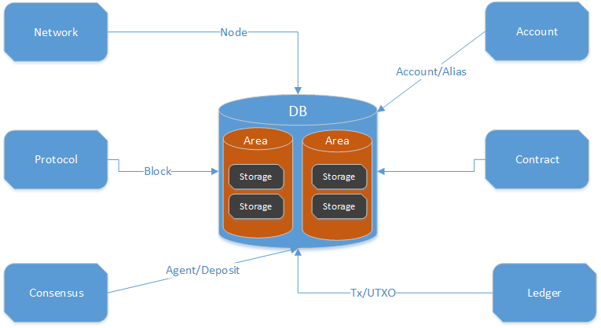

title: NULS存储模块解析
---

## 1、模块概述

​	存储模块在NULS中扮演着一个工具模块的角色，它提供了在本地存储数据的功能，各个模块都可以通过存储模块的接口对自己的数据进行存储和取出。目前NULS存储模块的数据库实现是LevelDB，开发者们也可以根据自己的需求使用不同的数据库实现。

## 2、模块功能

​	存储模块的功能主要分为保存数据、删除数据、查询数据；修改数据由覆盖保存或者先删除后保存来实现。而功能的实现分为单条数据的操作、批量操作，对序列化的二进制数据的操作、对model实例数据的操作等。

## 3、模块接口

- 接口定义类  `io.nuls.db.service.DBService`

```java
	/**
     * 创建一个数据区域
     * Create a data area
     *
     * @param areaName
     * @return
     */
    Result createArea(String areaName);

    /**
     * 创建一个自定义key比较器的数据区域
     * Create a data area for the custom key comparator.
     *
     * @param areaName
     * @param comparator 自定义key比较器/Custom key comparator.
     * @return
     */
    Result createArea(String areaName, Comparator<byte[]> comparator);

    /**
     * 列出当前数据库中所有Area名称
     * Lists all Area names in the current database
     *
     * @return
     */
    String[] listArea();

    /**
     * 按字节存储key-value
     * Store key-value in bytes.
     *
     * @param area
     * @param key
     * @param value
     * @return
     */
    Result put(String area, byte[] key, byte[] value);

    /**
     * 存储对象
     * Store the object
     *
     * @param area
     * @param key
     * @param value 需要存储的对象/Objects that need to be stored.
     * @param <T>
     * @return
     */
    <T> Result putModel(String area, byte[] key, T value);

    /**
     * 根据key删除value
     * Delete value according to key.
     *
     * @param area
     * @param key
     * @return
     */
    Result delete(String area, byte[] key);

    /**
     * 根据key获取value
     * Get value from the key.
     *
     * @param area
     * @param key
     * @return
     */
    byte[] get(String area, byte[] key);

    /**
     * 根据key和对象class获取指定对象
     * 前提是这个key的存储方式是putModel，否则value为null
     * Gets the specified object from the key and object class.
     * The premise is that this key is stored in a putModel, otherwise value is null.
     *
     * @param area
     * @param key
     * @param clazz 指定对象的class/Specifies the class of the object.
     * @param <T>
     * @return
     */
    <T> T getModel(String area, byte[] key, Class<T> clazz);

    /**
     * 根据key获取Object对象
     * Get the Object of Object from the key.
     *
     * param area
     * @param key
     * @return
     */
    Object getModel(String area, byte[] key);

    /**
     * 获取数据区域的所有key的无序集合
     * Gets an unordered collection of all keys in the data area.
     *
     * @param area
     * @return
     */
    Set<byte[]> keySet(String area);

    /**
     * 获取数据区域的所有key的有序集合
     * Gets an ordered collection of all keys in the data area.
     *
     * @param area
     * @return
     */
    List<byte[]> keyList(String area);

    /**
     * 获取数据区域的所有value的有序集合
     * Gets an ordered collection of all values in the data area.
     *
     * @param area
     * @return
     */
    List<byte[]> valueList(String area);

    /**
     * 获取数据区域的所有key-value的无序集合
     * Gets an unordered collection of all key-value in the data area.
     *
     * @param area
     * @return
     */
    Set<Entry<byte[], byte[]>> entrySet(String area);

    /**
     * 获取数据区域的所有key-value的有序集合
     * Gets an ordered set of all key-values in the data area.
     *
     * @param area
     * @return
     */
    List<Entry<byte[], byte[]>> entryList(String area);


    /**
     * 获取数据区域的所有key-value的有序集合，并指定返回的value对象
     * 前提是这个数据区域的存储方式是putModel，否则value为null
     * Gets the ordered collection of all key-value in the data area and specifies the returned value object.
     * The premise is that the storage mode in this data area is the putModel, otherwise value is null.
     *
     * @param area
     * @param clazz 指定对象的class/Specifies the class of the object.
     * @param <T>
     * @return
     */
    <T> List<Entry<byte[], T>> entryList(String area, Class<T> clazz);

    /**
     * 获取数据区域的所有value的有序集合，并指定返回的value对象
     * 前提是这个数据区域的存储方式是putModel，否则value为null
     * Gets the ordered collection of all values in the data area and specifies the returned value object.
     * The premise is that the storage mode in this data area is the putModel, otherwise value is null.
     *
     * @param area
     * @param clazz 指定对象的class/Specifies the class of the object.
     * @param <T>
     * @return
     */
    <T> List<T> values(String area, Class<T> clazz);

    /**
     * 指定数据区域的批量增删改操作
     * Specifies the batch add, delete, update operations in the data area.
     *
     * @param area
     * @return
     */
    BatchOperation createWriteBatch(String area);

    /**
     * 清除Area
     *
     * @param areaName
     * @return
     */
    Result destroyArea(String areaName);

    Result clearArea(String area);

```


- 批量操作接口定义类 `io.nuls.db.service.BatchOperation`

```java

 	/**
     * 增加或者更新操作
     * Add or update operations.
     *
     * @param key
     * @param value
     * @return
     */
    Result put(byte[] key, byte[] value);

    /**
     * 存储或者更新对象
     * Add or update the object
     *
     * @param key
     * @param value 需要存储或者更新的对象/Objects that need to be added or updated.
     * @return
     */
    <T> Result putModel(byte[] key, T value);

    /**
     * 删除操作
     * Delete operation
     *
     * @param key
     * @return
     */
    Result delete(byte[] key);

    /**
     * 执行批量操作
     * Perform batch operation
     *
     * @return
     */
    Result executeBatch();
```


## 4、模块架构

- 模块名称：db-module
- 模块ID：2




## 5、模块流程

NULS启动时，各模块进行初始化时会在Storage中初始化使用到的DB Area常量，在模块业务逻辑中，存储数据时会时会将对应的Area和数据传给对应的存储功能接口，DB模块再执行单条数据或批量的存取操作。

