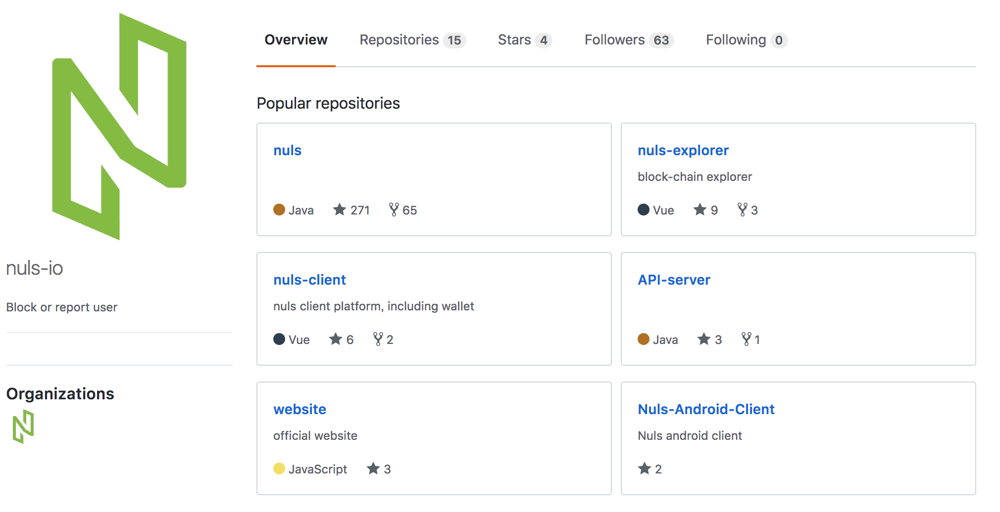

title: NULS 源码目录结构
---

* NULS官网：https://nuls.io
* NULS开源地址：https://github.com/nuls-io
* NULS技术论坛：http://nulsforum.org/?cat=17

## NULS源代码目录结构说明

* Nuls : NULS核心底层源代码
* Nuls-explorer : NULS区块链浏览器（https://nulscan.io）
* Nuls-client : NULS核心钱包
* Api-server : NULS数据服务，为NULS区块链浏览器以及在线钱包
* 移动端钱包等提供数据服务
* Website : NULS 官网代码

## NULS核心底层目录结构说明

   我们会重点介绍NULS核心底层，github地址为https://github.com/nuls-io/nuls。

   NULS最大的特点就是模块化设计，分为网络模块、存储模块、账户模块、账本模块、消息总线模块、通用协议模块、共识模块、智能合约模块、微内核模块、工具模块、客户端模块以及sdk模块。

* account-ledger-module ： 账户账本模块
* account-module ： 账户模块
* client-module ：客户端模块
* consensus-module ： 共识模块
* contract-module ：智能合约模块
* core-module ：微内核模块
* db-module ：存储模块
* ledger-module ：账本模块
* message-bus-module ：消息总线模块
* network-module ： 网络通信模块
* protocol-module ： 通用协议模块
* tools-module ： 通用工具模块

## 模块目录结构

上面介绍的为各模块的顶级目录，NULS中的模块分为两类，一类是业务非常清晰的模块，比如共识模块；一类是业务相对明确，默认为基础实现，比如网络模块。我们将拿这两个模块进行详细的说明。

### 网络模块

* network-module ： 是网络模块的顶级目录（类型为文件夹）
* network ： 为网络模块提供的服务接口定义（类型为pom工程）
* base ：网络模块的基础实现（也可以理解为默认实现，类型为文件夹）
* network-base :  network接口的实现工程（类型为pom工程）
* network-protocol :  网络模块的网络协议定义工程（类型为pom工程）
* network-rpc:  网络模块的rpc接口提供和实现工程（类型为pom工程）
* network-sdk :  网络模块对外提供的sdk（类型为pom工程）
* network-storage :  网络模块的存储实现工程（类型为pom工程）
* README.md ： 模块说明书，详细阐述模块的接口定义与使用方法（类型为md文件）

### 共识模块

* consensus-module ： 共识模块的顶级目录（类型为文件夹）
* consensus ： 共识模块的服务接口定义（类型为pom工程）
* poc ：poc共识机制的实现（类型为文件夹）
* consensus-poc-base :  基于POC共识机制的共识接口实现工程（类型为pom工程）
* consensus-poc-protocol :  POC共识机制的网络协议定义工程（类型为pom工程）
* consensus-poc-rpc:  POC共识机制的rpc接口提供和实现工程（类型为pom工程）
* consensus-poc-sdk :  POC共识机制对外提供的sdk（类型为pom工程）
* consensus-poc-storage :  POC共识机制的存储实现工程（类型为pom工程）
* README.md ： 模块说明书，详细阐述模块的接口定义与使用方法（类型为md文件）

## 对模块及目录结构的分析

NULS系统是以多个模块组合而成，模块的定义有一套规则：顶级目录—>接口工程、实现目录—>实现工程。也有相应的命名规则，比如一个模块为A，那么这个模块的结构如下：

* A-module
* A
* base
* A-base
* A-protocol
* A-rpc
* A-sdk
* A-storage

有变化的地方在于，这个模块有很明确的多种不同的实现方式，那么按照相应的实现方式来命名，比较典型的有共识模块和账本模块。这种情况下，比如一个模块为M，其实现方式为B，那么这个模块的结构如下：

* M-module
* M
* B
* M-B-base
* M-B-protocol
* M-B-rpc
* M-B-sdk
* M-B-storage

值得注意的是，不是所有模块的实现都必须包含这些工程，比如有的模块不需要用到存储，那么就不需要有storage，有的模块没有协议，那么就不需要protocl。

## 总结：
从NULS的目录结构命名来看，就显示出了NULS最初的巨大野心，NULS希望社区、企业、个人提供各种各样的模块到NULS的代码库，比如共识模块下的pow实现、pos实现等；也希望同一个模块能够出现质量更高、效率更好、功能更完善的模块，比如网络模块。
